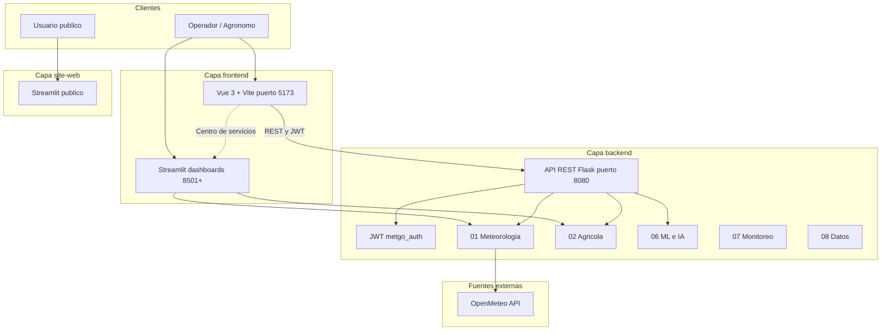
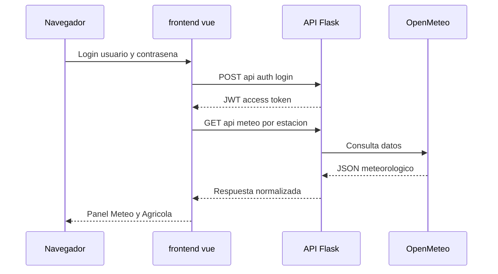
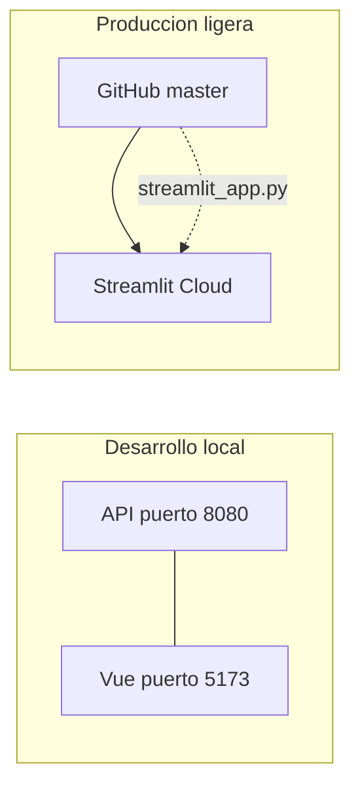
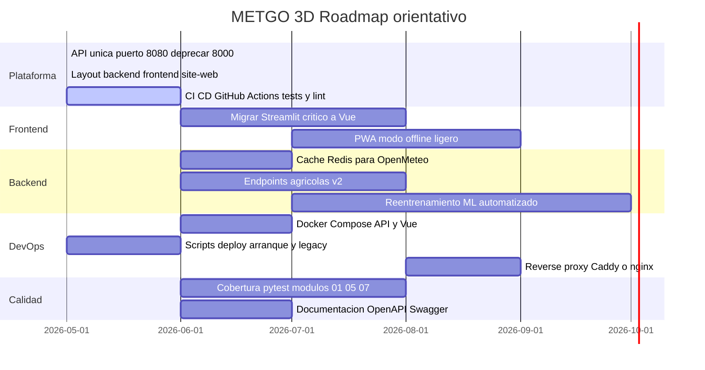

# METGO 3D — Sistema Integrado Quillota

[](https://www.python.org/)
[](https://vuejs.org/)
[](https://streamlit.io/cloud)
[](LICENSE)

Plataforma de **monitoreo meteorológico**, **gestión agrícola (MIP)** y **soporte a la decisión** orientada al Valle de Quillota y estaciones del Valle Central (Chile). Integra datos en tiempo casi real (OpenMeteo), modelos de ML, dashboards analíticos y una capa web moderna con autenticación JWT.

**Actualización (2026-05-23):** raíz organizada por capas (`backend` / `frontend` / `site-web`).

| Entorno | URL / referencia |
|---------|------------------|
| **Streamlit Cloud** | [metgo-3d-quillota-60gb.streamlit.app](https://metgo-3d-quillota-60gb.streamlit.app) |
| **Repositorio** | [github.com/miguellucero123/METGO_3D_Quillota_60GB](https://github.com/miguellucero123/METGO_3D_Quillota_60GB) |
| **Rama principal** | `master` |

---

## Tabla de contenidos

- [Visión general](#visión-general)
- [Arquitectura del sistema](#arquitectura-del-sistema)
- [Estructura del repositorio](#estructura-del-repositorio)
- [Stack tecnológico](#stack-tecnológico)
- [Inicio rápido](#inicio-rápido)
- [Configuración y seguridad](#configuración-y-seguridad)
- [API REST y frontend](#api-rest-y-frontend)
- [Despliegue](#despliegue)
- [Documentación](#documentación)
- [Hoja de ruta](#hoja-de-ruta-próximas-mejoras)
- [Mantenimiento del repositorio](#mantenimiento-del-repositorio)
- [Licencia y contacto](#licencia-y-contacto)

---

## Visión general

METGO 3D unifica en un solo ecosistema:

- **Ingesta y pronóstico meteorológico** (OpenMeteo, estaciones multi-zona).
- **Recomendaciones agrícolas** (riego, heladas, plagas, alertas).
- **Modelos predictivos** (scikit-learn, pipelines en `backend/06_Modelos_ML_IA`).
- **Interfaces de operación**: SPA Vue 3 (uso diario) y dashboards Streamlit (análisis profundo bajo demanda).
- **Capa pública** (`site-web/`) para exposición controlada.

El diseño sigue una **separación por capas** (`backend` · `frontend` · `site-web`) con resolución centralizada de rutas vía [`metgo_paths.py`](metgo_paths.py), compatible con layouts legacy y despliegue en Streamlit Cloud (`streamlit_app.py` en raíz).

### Estaciones soportadas

Quillota · Los Nogales · Hijuelas · Limache · Olmué

---

## Arquitectura del sistema

### Vista lógica (capas)



### Flujo de autenticación y datos (Vue)



### Puertos y procesos (desarrollo local)

| Servicio | Puerto | Ruta / comando |
|----------|--------|----------------|
| API REST | **8080** | `python backend/10_Deployment_Produccion/scripts/iniciar_api_rest.py` |
| Vue (Vite) | **5173** | `cd frontend/vue && npm run dev` |
| Streamlit principal | **8501** | `streamlit run streamlit_app.py` |
| Streamlit adicionales | 8502–8513 | Centro de servicios en Vue → `/servicios` |

> **Nota:** Use siempre la API en **8080** con JWT activo. Procesos antiguos en `:8000` sin rutas de auth producen `404` en login.

### Diagrama de despliegue (simplificado)



---

## Estructura del repositorio

```text
METGO_3D_Quillota_60GB/
├── backend/                    # Dominio, datos, ML, API, operaciones
│   ├── 01_Sistema_Meteorologico/
│   ├── 02_Sistema_Agricola/
│   ├── 03_Sistema_IoT_Drones/
│   ├── 05_APIs_Externas/       # api_rest/ (Flask + JWT)
│   ├── 06_Modelos_ML_IA/       # modelos .joblib / pipelines
│   ├── 07_Sistema_Monitoreo/   # auth compartida (metgo_auth.py)
│   ├── 08_Gestion_Datos/
│   ├── 09_Testing_Validacion/
│   ├── 10_Deployment_Produccion/
│   └── 12_Respaldos_Archivos/
├── frontend/
│   ├── vue/                    # SPA principal (Pinia, Vue Router, axios)
│   └── dashboards/             # Streamlit operativos
├── site-web/                   # Capa pública
│   └── streamlit/
├── docs/                       # Manuales y gobernanza
├── streamlit_app.py            # Entrypoint Streamlit Cloud (raíz)
├── metgo_paths.py              # Resolución de rutas (layout capas + legacy)
├── metgo_auth.py               # Wrapper → backend/07/.../metgo_auth.py
├── requirements.txt
└── .env.example
```

| Capa | Responsabilidad | Documentación |
|------|-----------------|---------------|
| [`backend/`](backend/README.md) | Lógica de negocio, ETL, ML, API, scripts de deploy | [`docs/INDICE_MODULOS.md`](docs/INDICE_MODULOS.md) |
| [`frontend/`](frontend/README.md) | UX operativa (Vue) y visualización Streamlit | [`docs/manuales/API_REST.md`](docs/manuales/API_REST.md) |
| [`site-web/`](site-web/README.md) | Exposición pública limitada | — |
| [`docs/`](docs/ESTRUCTURA_PROYECTO_METGO.md) | Arquitectura, procedimientos, Git | [`docs/PROPUSTA_LAYOUT_CAPAS.md`](docs/PROPUSTA_LAYOUT_CAPAS.md) |

Los módulos numerados **01–12** se conservan dentro de `backend/` para trazabilidad histórica y scripts existentes.

---

## Stack tecnológico

| Área | Tecnologías |
|------|-------------|
| **Backend** | Python 3.10+, Flask, Flask-CORS, PyJWT, python-dotenv |
| **Datos** | pandas, NumPy, OpenMeteo (HTTP), notebooks Jupyter |
| **ML** | scikit-learn, modelos serializados (`.joblib`, `.pkl`) |
| **Frontend** | Vue 3, Vite 6, Pinia, Vue Router, axios, lucide-vue-next |
| **Visualización legacy** | Streamlit, Plotly |
| **Calidad** | pytest (módulo 09), scripts de verificación |
| **DevOps** | Scripts `.bat` / PowerShell, Streamlit Cloud, Git |

---

## Inicio rápido

### Requisitos

- Python **3.10+** y `pip`
- Node.js **18+** y `npm` (solo para Vue)
- Git (opcional, para clonar y publicar)

### 1. Clonar e instalar

```bash
git clone https://github.com/miguellucero123/METGO_3D_Quillota_60GB.git
cd METGO_3D_Quillota_60GB
pip install -r requirements.txt
cp .env.example .env   # editar credenciales locales
```

### 2. Arranque integrado (Windows)

```bat
backend\10_Deployment_Produccion\scripts\iniciar_metgo_desarrollo.bat
```

Abrir en el navegador: **http://127.0.0.1:5173**  
Credenciales de desarrollo (si no hay `.env`): ver implementación en `metgo_auth` (fallback local).

### 3. Arranque manual (dos terminales)

```bash
# Terminal A — API
python backend/10_Deployment_Produccion/scripts/iniciar_api_rest.py

# Terminal B — Vue
cd frontend/vue
npm install
npm run dev
```

### 4. Streamlit (legacy / Cloud)

```bash
streamlit run streamlit_app.py
```

Dashboards adicionales: en Vue → **Centro de servicios** (`/servicios`) → iniciar solo el módulo necesario.

---

## Configuración y seguridad

| Variable | Descripción |
|----------|-------------|
| `METGO_PASSWORD_ADMIN` | Contraseña rol administrador |
| `METGO_PASSWORD_USER` | Contraseña rol usuario |
| `METGO_PASSWORD_METGO` | Contraseña rol metgo |
| `METGO_JWT_SECRET` | Secreto de firma JWT (API + sesión Vue) |
| `METGO_API_PORT` | Puerto API (default `8080`) |

- **Nunca** commitear `.env` (está en `.gitignore`).
- En **Streamlit Cloud**: Settings → Secrets → mismas variables `METGO_PASSWORD_*`.
- Plantilla: [`.env.example`](.env.example).

Autenticación compartida: [`backend/07_Sistema_Monitoreo/scripts/metgo_auth.py`](backend/07_Sistema_Monitoreo/scripts/metgo_auth.py) (wrapper en raíz: `metgo_auth.py`).

---

## API REST y frontend

### Endpoints principales

| Método | Ruta | Descripción |
|--------|------|-------------|
| `GET` | `/api/health` | Estado del servicio |
| `POST` | `/api/auth/login` | Emisión de JWT |
| `GET` | `/api/meteo/{estacion}` | Datos meteorológicos |
| `GET` | `/api/alertas` | Alertas activas |
| `GET` | `/api/agricola/*` | Indicadores agrícolas |
| `GET` | `/api/modulos` | Catálogo de módulos |
| `GET` | `/api/servicios/streamlit` | Estado de dashboards Streamlit |
| `POST` | `/api/servicios/streamlit/{id}/iniciar` | Orquestación local Streamlit |

Documentación ampliada: [`docs/manuales/API_REST.md`](docs/manuales/API_REST.md).

### Vistas Vue

| Ruta | Función |
|------|---------|
| `/` | Panel general |
| `/meteo` | Meteorología |
| `/agricola` | Gestión agrícola |
| `/monitoreo` | Alertas |
| `/servicios` | Centro de servicios (Vue + Streamlit bajo demanda) |
| `/modulos` | Catálogo de módulos |
| `/configuracion` | Configuración por estación |

Proxy de desarrollo: `frontend/vue` → API en `127.0.0.1:8080` (ver `vite.config.js` y `.env.development`).

---

## Despliegue

### Streamlit Cloud

| Parámetro | Valor |
|-----------|--------|
| **Repository** | `miguellucero123/METGO_3D_Quillota_60GB` |
| **Branch** | `master` |
| **Main file** | `streamlit_app.py` |
| **Páginas** | `pages/1_Resumen_publico.py` (site-web) · `pages/2_Panel_operadores.py` |

Tras cada push: **Reboot app** en Streamlit Cloud. Guía: [`docs/manuales/STREAMLIT_CLOUD.md`](docs/manuales/STREAMLIT_CLOUD.md).

### Publicación en GitHub

```bat
backend\10_Deployment_Produccion\scripts\revisar_estado_git.bat
git push origin master
```

Procedimiento detallado: [`docs/manuales/PUBLICAR_GITHUB.md`](docs/manuales/PUBLICAR_GITHUB.md).

---

## Documentación

| Documento | Contenido |
|-----------|-----------|
| [`docs/INDICE_MODULOS.md`](docs/INDICE_MODULOS.md) | Mapa de módulos 01–12 |
| [`docs/ESTRUCTURA_PROYECTO_METGO.md`](docs/ESTRUCTURA_PROYECTO_METGO.md) | Reglas de organización y carpetas |
| [`docs/PROPUSTA_LAYOUT_CAPAS.md`](docs/PROPUSTA_LAYOUT_CAPAS.md) | Layout backend / frontend / site-web |
| [`docs/manuales/API_REST.md`](docs/manuales/API_REST.md) | API Flask |
| [`docs/manuales/PUBLICAR_GITHUB.md`](docs/manuales/PUBLICAR_GITHUB.md) | Git y CI |

---

## Hoja de ruta (próximas mejoras)

Roadmap orientado a producción y mantenibilidad. Las fases son orientativas; el orden puede ajustarse según prioridad de negocio.



### Detalle por iniciativa

| Prioridad | Iniciativa | Beneficio |
|-----------|------------|-----------|
| Alta | **Unificar entrypoint de desarrollo** (`iniciar_metgo_desarrollo.bat` + docs) | Menos confusión de puertos |
| Alta | **OpenAPI / Swagger** para `api_rest` | Integración y pruebas por terceros |
| Alta | **Migración progresiva Streamlit → Vue** (meteo, agrícola, alertas) | Un solo frontend en producción |
| Media | **CI en GitHub** (smoke tests, `ruff`/`flake8`) | Regresiones detectadas en PR |
| Media | **Orquestación Streamlit** estable en Windows/Linux | Centro de servicios sin procesos huérfanos |
| Media | **Modelos ML**: versionado y `.gitignore` selectivo para artefactos pesados | Repo más liviano; LFS opcional |
| Media | **site-web**: landing estática + dashboard público | Separación clara operador / público |
| Baja | **App móvil** (`frontend/app_movil`) alineada con API JWT | Campo en terreno |
| Baja | **IoT / drones** (módulo 03) conectado a API | Datos propios además de OpenMeteo |

---

## Mantenimiento del repositorio

Scripts de reorganización (ejecutar con `--dry-run` antes de aplicar):

```bash
python backend/10_Deployment_Produccion/scripts/reorganizar_proyecto_v2.py --dry-run
python backend/10_Deployment_Produccion/scripts/reorganizar_proyecto_v3.py --dry-run
python backend/10_Deployment_Produccion/scripts/reorganizar_layout_capas_v4.py --dry-run
```

Resolución de rutas en código Python:

```python
import metgo_paths
metgo_paths.setup_all_paths()
# metgo_paths.streamlit_dashboard_path("sistema_auth_dashboard_principal_metgo.py")
```

---

## Licencia y contacto

- **Licencia:** [MIT](LICENSE)
- **Issues:** [GitHub Issues](https://github.com/miguellucero123/METGO_3D_Quillota_60GB/issues)
- **Contacto:** miguel.lucero@metgo3d.com

---

<p align="center">
  <sub>METGO 3D · Monitoreo inteligente para la agricultura del Valle de Quillota · Última actualización de estructura: mayo 2026</sub>
</p>
