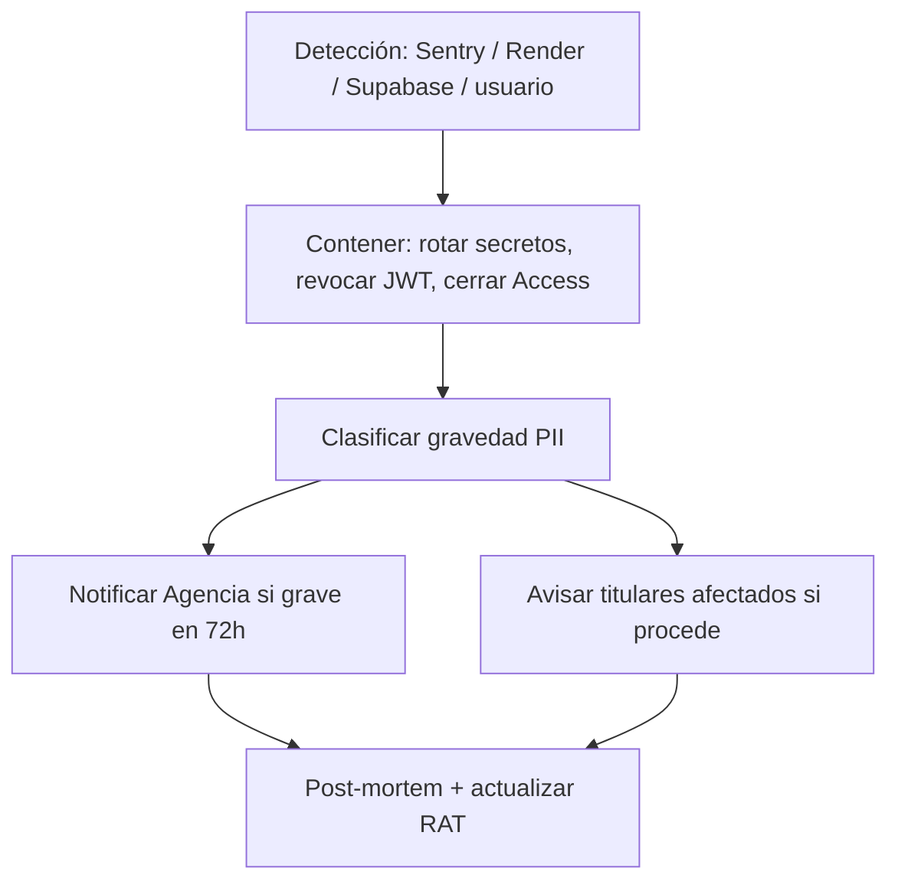

# Plan integral — Ley 21.719 + seguridad técnica METGO 3D

> Corte: **2026-09-03** · Vigencia objetivo ley: **2026-12-01**  
> Ámbito: `metgo3d.com` + SPAs Pages + API Render + Supabase `ylivhjigvxqzpzchllte`  
> **Fase:** cumplimiento / DT-seguridad (gobernanza + producto)  
> **Aviso:** este plan es operativo-técnico; la calificación jurídica final debe revisarla un asesor en protección de datos.

---

## 0. Mapa de roles (decidir y fijar por escrito)

| Actor | Rol bajo Ley 21.719 | Implicación |
|-------|---------------------|-------------|
| **METGO 3D SpA** (cuenta identity, login, facturación, marketing WP) | **Responsable** del tratamiento | Decide fines, bases legales, plazos, derechos ARCO/olvido |
| **Cliente B2B** (faena / productor) que carga datos de operadores propios | Puede ser **Responsable**; METGO **Encargado** | Contrato de encargo + instrucciones + medidas |
| **Supabase / Render / Cloudflare / Zoho / Stripe** | Subencargados / proveedores | DPA o cláusulas + lista de subencargados |

**Acción G0 (semana 1):** documento de 1 página “Roles y bases legales por sitio” firmado por los 2 fundadores.

---

## 1. Inventario RAT (Registro de Actividades de Tratamiento)

### 1.1 Tratamientos ya existentes en código

| ID | Proceso | Datos personales | Finalidad | Base legal (borrador) | Almacén | Plazo (propuesta) | Acceso |
|----|---------|------------------|-----------|----------------------|---------|-------------------|--------|
| T1 | Registro / login SPA | Email, nombres/apellidos cifrados, tel. cifrado, RUT hash, password hash, sitio/faena | Cuenta y acceso al servicio | Contrato / medidas precontractuales + consentimientos UI | Supabase `usuarios_app`, `orgs` | Mientras haya cuenta + 90 días post-baja | API service_role |
| T2 | Consentimientos | Flags términos/privacidad/veracidad + timestamp | Prueba de consentimiento | Consentimiento | `consentimientos` | 5 años o legal | service_role |
| T3 | Auditoría auth | Eventos login/registro (email, IP si se guarda) | Seguridad / evidencia | Interés legítimo seguridad | `audit_auth` | 12–24 meses | service_role |
| T4 | Suscripciones / entitlements | Plan, org_id, estado | Cobro y límites de producto | Contrato | `suscripciones`, `entitlements` | Contable 6–10 años | service_role |
| T5 | Alertas / notificaciones | Email destino, contenido alerta | Aviso operativo | Contrato | outbox JSONL / SMTP | 90 días outbox | ops |
| T6 | WordPress / marketing | Leads, comentarios, IP WP | Marketing / web | Consentimiento / legítimo interés | WP.com | Política WP | admins WP |
| T7 | Turnstile / logs edge | IP, fingerprint anti-bot | Abuso | Interés legítimo | Cloudflare | Política CF | — |
| T8 | Meteo / aire / spati series | **No PII** (estaciones, PM, NWP) | Servicio técnico | N/A PII | Supabase meteo_* | Según producto | SELECT anon hoy |

### 1.2 Entregables RAT

- [x] Planilla RAT (CSV/Notion) con columnas: ID, datos, categoría (sensible/no), finalidad, base legal, cesiones, plazos, medidas, encargado → `RAT_METGO_v0.csv`  
- [ ] Diagrama flujo datos: SPA → API → Supabase / SMTP / Stripe  
- [ ] Lista subencargados + enlaces a DPA  

**Owner:** un fundador (DPD interino) · **Plazo:** 2 semanas  

**Artefacto repo:** `config/compliance/RAT_METGO.template.csv` (plantilla).

---

## 2. Controles técnicos — adaptar reglas ya auditadas

Integra la auditoría API/tokens/Supabase y Cloudflare Pages.

### 2.1 Ya implementado (evidencia)

| Control | Evidencia en repo |
|---------|-------------------|
| HTTPS | Cloudflare Pages + Render |
| Auth por usuario + JWT | `auth_routes`, `METGO_JWT_SECRET` |
| Cifrado PII en reposo | `pii_crypto.py` + `METGO_PII_KEK` (AES-GCM) |
| Consentimientos en registro | `validators.py` + UI `RegistroView` |
| Derecho al olvido (parcial) | `delete_user_data` / endpoint auth |
| RLS deny identity | migraciones `identity_rls_deny_anon`, `supabase_advisor_hardening` |
| Cron protegido | `CRON_SECRET` en GitHub + Render |
| OM acotado | `openmeteo_ciclo` + `FETCH_MODE=ciclo` |
| Headers seguridad SPA | `public/_headers` |
| Policy Pages as-code | `config/cloudflare/pages_security.json` + workflow |

### 2.2 Gaps a cerrar (reglas técnicas)

| # | Regla | Por qué Ley 21.719 / seguridad | Acción | Prioridad | Plazo |
|---|-------|--------------------------------|--------|-----------|-------|
| R1 | Rechazar `SUPABASE_ANON` en production | Evitar bypass confuso / writes rotas | Endurecer `supabase_db/client.py` | P0 | 1 sem |
| R2 | No filtrar service_role | Brecha = acceso total | Solo Render secrets; rotación documentada | P0 | continuo |
| R3 | Revisar SELECT `anon` meteo/spati | Datos no PII pero operativos | Decisión: mantener público vs JWT-only | P1 | 3 sem |
| R4 | MFA admin | Control de accesos | MFA Cloudflare Zero Trust + cuenta Render | P1 | 4 sem |
| R5 | Previews Pages = none | Menos superficie | Workflow harden (secrets CF) | P1 | 1 sem |
| R6 | Logs `audit_auth` + IP/retention | Evidencia accesos | Política retención + job purge | P1 | 6 sem |
| R7 | Backup/restore probado | Continuidad | Runbook restore Supabase PITR + drill | P1 | 6 sem |
| R8 | Exportar mis datos (portabilidad) | Derechos titulares | `GET /api/auth/me/export` JSON | P1 | 8 sem |
| R9 | Olvido completo | Hoy anonimiza user; revisar consentimientos/orgs huérfanas | Ampliar `delete_user_data` | P1 | 8 sem |
| R10 | Política privacidad / cookies metgo3d.com | Transparencia | Páginas legales WP + enlace en registro | P0 | 2 sem |
| R11 | Dependabot + CI | Parches | Ya `.github/dependabot.yml` | P2 | activo |
| R12 | Inventario endpoints / MFA laptops | Gestión endpoints | Lista equipos + Bitwarden + pantalla bloqueo | P2 | 4 sem |

### 2.3 Privacidad por diseño (default)

Reglas de producto obligatorias en PRs nuevas:

1. PII solo vía API + cifrado (`pii_crypto`); nunca en logs claros.  
2. Consentimiento granular antes de marketing.  
3. `METGO_ALLOW_SELF_REGISTER=0` en prod salvo vertical con Turnstile.  
4. OpenAPI actualizado si hay campos personales nuevos.  
5. Checklist PR: “¿afecta RAT / olvido / export?”  

Checklist: `config/compliance/CHECKLIST_PR_PRIVACIDAD.md`.

---

## 3. Gobernanza y roles (organización)

| Rol | Persona (propuesta 2 fundadores) | Responsabilidad |
|-----|----------------------------------|-----------------|
| **DPD / encargado cumplimiento** (interino) | Miguel Lucero (`DPD_INTERINO.md`) | RAT, políticas, notificación 72 h, relación Agencia |
| **Responsable técnico seguridad** | Co-fundador (completar) | Secrets, RLS, backups, Access, CI |
| Asesor legal externo | Contratar Q4 2026 | Revisión bases legales + textos |

**Documentos mínimos:**

1. Política de privacidad pública (WP)  
2. Política interna de seguridad / uso de dispositivos  
3. Procedimiento de derechos (acceso, rectificación, cancelación, oposición, portabilidad)  
4. Procedimiento de brechas (72 h)  
5. Contrato Encargado (plantilla B2B faenas)  

Carpeta: `config/compliance/` (plantillas). Textos legales finales → WP + vault, no necesariamente Git público.

---

## 4. Gestión de brechas (72 horas)

### 4.1 Flujo

### 4.2 Runbook técnico inmediato

1. Rotar `METGO_JWT_SECRET`, `SUPABASE` service_role, `CRON_SECRET`, `METGO_PII_KEK` (con `METGO_PII_KEK_PREV`).  
2. Forzar logout (invalidar tokens / bump `iat`).  
3. Revisar `audit_auth` últimas 72 h.  
4. Registrar incidente en `config/compliance/incidentes/` (plantilla).  

**Owner DPD:** decisión de notificación legal. **Owner técnico:** pasos 1–3 &lt; 4 h.

---

## 5. Evidencia y auditoría (demostrar cumplimiento)

| Evidencia | Dónde | Frecuencia |
|-----------|-------|------------|
| RAT versionado | Notion/Drive + hash en compliance | Trimestral |
| Migraciones RLS | `supabase/migrations/*` | En cada cambio |
| Logs auth | `audit_auth` | Continuo |
| Health PII KEK | `/api/health` flag sin secretos | Continuo |
| Drills backup | Acta PDF | Semestral |
| Capacitación | Lista asistencia | Anual |
| Decisiones de riesgo | `DECISIONES_SEGURIDAD.md` | Al cambiar control |

---

## 6. Roadmap hasta 2026-12-01

| Ventana | Entregables | Ligado a |
|---------|-------------|----------|
| **Sep 2026 (ahora)** | G0 roles; RAT v0; R1 client.py; R5 CF secrets+workflow; R10 textos legales draft; política Pages | Técnico + legal draft |
| **Oct 2026** | R4 MFA checklist; R6 retención logs; R7 runbook+drill; plantilla Encargado B2B; checklist PR | Controles + contratos |
| **Nov 2026** | R8 export; R9 olvido ampliado; capacitar equipo; ensayo mesa de brecha 72 h | Derechos + respuesta |
| **Dic 2026** | Revisión asesor; RAT v1 firmado; evidencias empaquetadas; go-live cumplimiento | Cierre |

---

## 7. Adaptación de “reglas de seguridad” (síntesis ejecutable)

1. **Datos personales** → solo identity vía API + PII cifrado + RLS deny clientes.  
2. **Datos técnicos meteo** → no PII; decidir si siguen públicos (anon) o detrás de JWT.  
3. **Tokens** → GitHub Secrets / Render; automatizar Pages harden; no Cloudflare token en `.env` salvo ops.  
4. **APIs externas** → ciclo 00/12; no scripts legacy en prod.  
5. **Ley 21.719** → RAT + derechos + brechas + evidencia, no solo HTTPS.

---

## 8. Primer sprint (próximos 7 días)

1. ~~Completar plantilla RAT (T1–T8).~~ **Hecho** → `RAT_METGO_v0.csv`  
2. ~~Implementar R1 (rechazo ANON en production).~~ **Hecho** (`6e5200c`+)  
3. ~~Cargar `CLOUDFLARE_*` en GitHub Secrets y correr workflow Pages security.~~ **Hecho**  
4. ~~Publicar / actualizar política de privacidad y términos en metgo3d.com (borrador).~~ **Hecho** R10 — `/privacidad/` `/terminos/` + enlaces registro  
5. ~~Nombrar DPD interino por escrito.~~ **Hecho** → `DPD_INTERINO.md`  

### Avance Sep 2026 (código)

| Ítem | Estado |
|------|--------|
| R1 anon en prod | Hecho |
| R5 Pages harden as-code | Hecho (secrets CF + workflow) |
| R6 retención audit_auth | Hecho — `compliance_retention` + cron mensual |
| R8 portabilidad export | Hecho — `GET /api/auth/me/export` |
| R9 olvido ampliado | Hecho — password reset + scrub IP audit |
| R10 textos legales WP + registro | Hecho — metgo3d.com + SPA RegistroView |
| RAT v0 + DPD interino | Hecho — `RAT_METGO_v0.csv` · `DPD_INTERINO.md` |
| R2 rotación secrets | Hecho (runbook) — `ROTACION_CREDENCIALES_R2.md` |
| R3 SELECT anon | Hecho (decisión) — `DECISION_R3_ANON_SELECT.md` |
| R4 MFA admin | **Hecho A1–A4** (GitHub, CF, Render, Supabase) — opcionales Zoho/WP |
| R7 backup/restore | Runbook + acta plantilla — falta drill (hoy: documental) |
| R12 inventario | Hecho (plantilla) — `INVENTARIO_ENDPOINTS_R12.csv` |
| Encargado B2B | Hecho (borrador) — `CONTRATO_ENCARGADO_B2B.md` |
| Derechos UI (export/olvido) | Hecho — sección en `CuentaView` (SPA) |
| Procedimiento derechos | Hecho — `PROCEDIMIENTO_DERECHOS_TITULARES.md` |
| Turnstile ops | Guía — `OPS_TURNSTILE.md` (keys pendientes en Render) |
| Runbook brechas 72 h | Hecho — `config/compliance/RUNBOOK_BRECHAS_72H.md` |
| Dependabot | Hecho |
| Pendientes humanos | `REQUISITOS_PENDIENTES.md` |
---

## Referencias código

- `backend/.../identity/pii_crypto.py`, `identity_store.py` (`delete_user_data`)  
- `backend/.../auth_routes.py` (olvido)  
- `supabase/migrations/20260805180000_identity_rls_deny_anon.sql`  
- `supabase/migrations/20260831140000_supabase_advisor_hardening.sql`  
- `config/cloudflare/pages_security.json`  
- `scripts/ops/CLOUDFLARE_PAGES_HARDENING.md`  
- Canvas auditoría: `api-tokens-supabase-audit`
