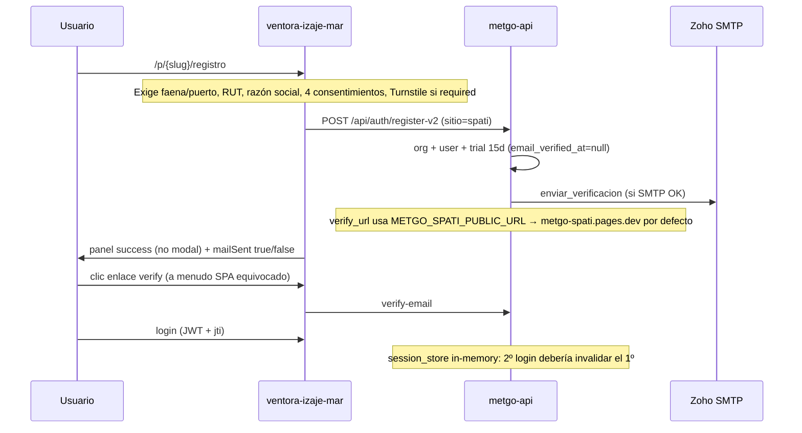

# Plan — Auth / alta de usuarios VENTORA Izaje Mar

**Producto:** `ventora-izaje-mar` (+ API compartida identity)  
**Fecha:** 2026-09-10  
**Estado implementación:** en curso — Fase 0/1/2 parcial/3 en código (falta ops Render + migración SQL).  
**Objetivo:** registro operable (universal o pago), email de confirmación real, feedback de activación claro, y control de sesión multi-dispositivo.

**Fase roadmap:** 2.x producto / ops comerciales · compliance R8/R9 ya existen.

---

## 1. Análisis — qué hay hoy

### 1.1 Flujo actual



### 1.2 Problemas reportados ↔ causa raíz

| Problema | Causa en código | Evidencia |
|----------|-----------------|-----------|
| Misma cuenta en 2 PCs a la vez | Sesión única **solo en RAM** (`session_store._CURRENT`). Tras cold start / redeploy / multi-worker Render, `is_session_active` **permite** JWT sin registro → ambos viven. | `backend/.../identity/session_store.py` L50–59 |
| Alta con “prerequisitos” rígidos | `validators`: sitio `spati` **obliga faena**; RUT + razón social + 4 checks. No hay modo “solo email” ni gate de pago al inicio. | `identity/validators.py` L122–123 · `RegistroView.vue` |
| No llega correo de confirmación | (a) SMTP no configurado → `sent:false mode=log`; (b) URL de verify apunta a **SPATI**, no a Ventora; (c) enlace `/f/{faena}/verificar` en SPA Ventora es `/p/...` o rutas distintas. | `email_notify.py` · `_public_spa_base` sin `ventora` · `VerificarEmailView` usa `/f/` |
| No se ve “cuenta activada” | Success = bloque estático; verify = texto + redirect 1,5 s; login banner solo si `?registered=1`. Sin modal/toast de activación. | `RegistroView` · `VerificarEmailView` · `LoginView` |
| Risk extra | Mock login en FE si email `miguel.lucero@metgo3d.com` (bypass JWT). | `ventora-izaje-mar/src/services/authApi.js` |

### 1.3 Qué ya existe y se reutiliza

- `POST /api/auth/register-v2`, `verify-email`, `reenviar-verificacion`
- Billing: `POST /api/billing/checkout` + webhook Stripe (S2; keys a menudo pendientes)
- FE: `session_replaced` → limpia token + mensaje en login
- Tests: `test_identity_s1` ya cubre segundo login → 401

---

## 2. Decisiones de producto (cerrar antes de codear)

| # | Decisión | Opciones | Recomendación operativa |
|---|----------|----------|-------------------------|
| D1 | Sesión | (A) 1 sesión activa (kick) · (B) N dispositivos con tope · (C) libre | **A** para B2B/piloto (seguridad). Tope **B=3** solo si cliente lo pide. |
| D2 | Cómo entra al servicio | (A) Universal self-serve trial · (B) Solo pago · (C) Trial corto + upgrade obligatorio | **C:** registro universal mínimo → trial N días → bloqueo o paywall Stripe. |
| D3 | Datos al registrar | Mínimo vs KYC completo | **Mínimo** en alta: email, password, consents TOS/privacy. Empresa/RUT en `/cuenta` o post-pago. Faena/puerto: picker opcional o “elegir después”. |
| D4 | Producto SPA verify | ¿URL Ventora o SPATI? | **Ventora** para altas desde `ventora-izaje-mar`. Env `METGO_VENTORA_PUBLIC_URL`. |

Sin D1–D4 firmados, no mezclar PRs.

---

## 3. Plan de implementación (fases)

### Fase 0 — Ops inmediato (sin code grande) · ~30–60 min

**Objetivo:** que el correo y el enlace funcionen mañana.

| Paso | Acción | Criterio de hecho |
|------|--------|-------------------|
| 0.1 | Verificar en Render: `METGO_SMTP_HOST/PORT/USER/PASSWORD/FROM/TLS` | Health o registro de prueba → `email.sent=true` |
| 0.2 | Setear `METGO_VENTORA_PUBLIC_URL=https://ventora-izaje-mar.pages.dev` (y/o apuntar SPATI URL solo si el alta es desde SPATI) | Enlace del mail abre Ventora |
| 0.3 | Probar registro → inbox → verify → login | Cuenta `email_verified_at` en Supabase |
| 0.4 | Quitar / guardar detrás de `import.meta.env.DEV` el mock login de `authApi.js` | Prod no bypass |

**Archivos:** Render env · `ventora-izaje-mar/src/services/authApi.js` · `.env.example`

---

### Fase 1 — Sesión única persistente · P0

**Objetivo:** segundo PC invalida al primero de forma fiable.

| Paso | Trabajo | Archivos |
|------|---------|----------|
| 1.1 | Tabla Supabase `auth_sessions` (`user_key`, `jti`, `updated_at`, opcional `user_agent`) + migración | `supabase/migrations/…_auth_sessions.sql` |
| 1.2 | `session_store.py`: leer/escribir Supabase (fallback memoria solo tests/local) | `identity/session_store.py` |
| 1.3 | Flag `METGO_SINGLE_SESSION=1` (default on en prod) | `auth_routes.py`, `.env.example` |
| 1.4 | FE: toast/modal al `session_replaced` (no solo `sessionStorage`) | `authApi.js`, `LoginView.vue`, i18n |
| 1.5 | Test integración: 2 logins → 1º 401 persistiendo entre “restart” mock | `tests/test_identity_s1.py` |

**Verificación:** login PC-A → login PC-B → refresh PC-A → 401 + mensaje claro.

---

### Fase 2 — Registro universal + gate de acceso · P0/P1

**Objetivo:** alta simple; acceso al panel según plan/pago.

| Paso | Trabajo | Archivos |
|------|---------|----------|
| 2.1 | Contrato OpenAPI: `register-v2` body mínimo + `access_mode=trial\|paid` | `openapi.yaml` |
| 2.2 | Validators: faena **opcional** para Ventora; RUT/razón social opcionales en trial; consents TOS+privacy obligatorios | `validators.py` |
| 2.3 | `registrar_v2`: si no hay faena → org sin faena + hub “elegir puerto”; entitlement trial | `identity_store.py` |
| 2.4 | Gate acceso: sin `email_verified` → 403 `email_unverified`; trial vencido / sin pago → 403 `subscription_required` | `auth_routes` / identity access |
| 2.5 | SPA registro: 2 pasos — (1) email+pass+consents · (2) opcional puerto · CTA “Continuar con piloto” / “Pagar plan” | `RegistroView.vue`, i18n, `site.config` stations |
| 2.6 | Cuenta: Stripe checkout real (keys Render) + éxito → plan active | `CuentaView.vue` (Ventora), `identity_routes` billing |

**Modelo de ingreso (recomendado D2=C):**

1. Cualquiera crea cuenta (email verificado).  
2. Piloto N días (`plans_catalog.trial_days`).  
3. Al vencer: solo lectura landing o paywall en hub.  
4. Pago Stripe → `starter`/`pro` + faenas contratadas.

---

### Fase 3 — Email + UX activación · P0

**Objetivo:** correo fiable + “cuenta activada” visible.

| Paso | Trabajo | Archivos |
|------|---------|----------|
| 3.1 | `_public_spa_base`: producto `ventora` **o** detectar Origin/`X-Metgo-Client` / body `spa=ventora` | `identity_routes.py` |
| 3.2 | Verify URL Ventora: `/p/{puerto}/verificar?token=` **y** `/verificar?token=` genérico | router + `_verify_email_url` |
| 3.3 | HTML email (no solo texto): marca VENTORA, CTA botón, copy ES/EN | `email_notify.py` |
| 3.4 | Registro: modal/dialog éxito (activado pendiente de mail) + estado mail fail con “Reenviar” | `RegistroView.vue` |
| 3.5 | Verify: pantalla “Cuenta activada” (popup/modal) → CTA “Entrar” (no redirect silencioso) | `VerificarEmailView.vue` |
| 3.6 | Login: banner si `?verified=1` | `LoginView.vue` |
| 3.7 | Log estructurado `email.sent` / error SMTP en audit (sin PII de más) | identity_routes |

**Verificación:** registro → mail en &lt;2 min → clic → modal activada → login OK.

---

### Fase 4 — Hardening / ops · P1

| Paso | Trabajo |
|------|---------|
| 4.1 | Turnstile keys en Render (anti-bots en registro universal) |
| 4.2 | Rate limits ya existen; revisar umbrales tras abrir registro |
| 4.3 | Runbook: `config/compliance` + `OPS` — “alta Ventora + SMTP + sesión” |
| 4.4 | Alinear `frontend/spati` con mismos cambios (misma API) |
| 4.5 | Quitar placeholders `puerto_iquique` → slugs reales `iqq` / `ventanas_muelle` |

---

## 4. Archivos a tocar (mapa)

| Capa | Rutas |
|------|-------|
| API | `backend/05_APIs_Externas/api_rest/identity/{session_store,identity_store,identity_routes,validators,email_notify,plans_catalog}.py` · `auth_routes.py` · `openapi.yaml` |
| DB | `supabase/migrations/*_auth_sessions.sql` (+ opcional columnas si hace falta) |
| SPA Ventora | `ventora-izaje-mar/src/views/{RegistroView,VerificarEmailView,LoginView,CuentaView}.vue` · `services/authApi.js` · `router/index.js` · `i18n/locales/{es,en}.json` |
| SPA hermana | `frontend/spati/...` (parity) |
| Ops/docs | `.env.example` · `config/compliance/OPS_TURNSTILE.md` · este plan · `PLAN_CONTINUIDAD_IMPLEMENTACION.md` |

---

## 5. Orden de entrega sugerido

1. **Fase 0** (ops SMTP + URL Ventora + quitar mock) — desbloquea correo.  
2. **Fase 3.1–3.6** (verify URL + UX activación) — percepción “funciona”.  
3. **Fase 1** (sesión persistente) — cierra multi-PC.  
4. **Fase 2** (registro universal + paywall) — modelo comercial.  
5. **Fase 4** hardening.

Cada fase = PR pequeño + smoke en https://ventora-izaje-mar.pages.dev

---

## 6. Criterios de aceptación (Definition of Done)

- [ ] No se puede operar con el mismo usuario en 2 navegadores tras login en el segundo (401 + mensaje).  
- [ ] Registro sin conocer slug de puerto (o picker opcional).  
- [ ] Correo de verificación llega y el enlace abre **Ventora**.  
- [ ] Tras verify: UI explícita “Cuenta activada”.  
- [ ] Tras registro: UI explícita éxito + estado del mail (enviado / falló + reenviar).  
- [ ] Trial o Stripe controlan acceso al hub (no solo “cuenta creada”).  
- [ ] OpenAPI + test CI verdes; sin secretos en Git.

---

## 7. Verificación

```powershell
# Health / SMTP indireto vía registro controlado
python scripts/ops/check_prod_health_flags.py

# Tras deploy API
# 1) Registrar email de prueba en /registro
# 2) Confirmar mail + verify
# 3) Login PC-A y PC-B → PC-A debe perder sesión
```

URLs: https://ventora-izaje-mar.pages.dev/registro · `/p/iqq/registro` · `/verificar?token=…`

---

## 8. Fuera de alcance (esta entrega)

- MFA de usuario final (solo MFA admin R4).  
- KYC SII automático del RUT.  
- Multi-tenant RBAC fino por grúa/muelle.  
- Redis dedicado (Supabase sessions alcanza en Render free).

---

## 10. Hecho en código (2026-09-10)

| Ítem | Estado |
|------|--------|
| Mock login FE eliminado | Hecho |
| `METGO_VENTORA_PUBLIC_URL` + verify `/p/.../verificar` y `/verificar` | Hecho |
| Registro Ventora sin faena/RUT obligatorios (`producto=ventora`) | Hecho |
| Modal “Cuenta activada” + panel éxito registro | Hecho |
| `session_store` + migración `auth_sessions` | Hecho (aplicar SQL en Supabase) |
| Tests `test_registro_ventora_sin_faena_ni_rut` + sesión única | Verde |

### Ops pendiente (humano)

1. Supabase SQL Editor → ejecutar `supabase/migrations/20260910180000_auth_sessions.sql`  
2. Render env: `METGO_VENTORA_PUBLIC_URL=https://ventora-izaje-mar.pages.dev` + SMTP Zoho OK  
3. Redeploy API + Pages Ventora  

---

## 9. Preguntas abiertas (responder para arrancar Fase 2)

1. ¿Sesión estricta 1 dispositivo (**D1=A**) o hasta 3?  
2. ¿Trial cuántos días en Ventora (hoy 15)?  
3. ¿Registro universal ya, o primero solo arreglar mail + sesión + UX?  
4. ¿Stripe keys listas en Render o mock checkout un tiempo más?
