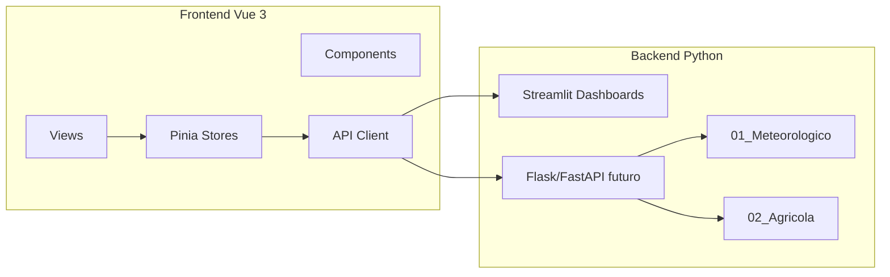

# Estructura del Proyecto METGO — Guía de Organización

> **Versión:** 3.0 · **Fecha:** 2026-05-23  
> Define dónde va cada tipo de archivo, cómo crear carpetas nuevas y cómo conviven Streamlit, Vue.js y los módulos Python.

---

## 1. Principios de diseño

| Principio | Descripción |
|-----------|-------------|
| **Raíz mínima** | Solo entrypoints, configuración global y documentación de entrada |
| **Módulos numerados** | Cada dominio en su carpeta `NN_NombreModulo/` |
| **Compatibilidad** | Wrappers en raíz para scripts y despliegues existentes |
| **Frontend Vue.js** | UI moderna en `frontend/vue/` (antes `04_Dashboards_Unificados/frontend_vue`) |
| **Backend Python** | Lógica, ML, APIs y Streamlit en módulos `01`–`12` |

---

## 2. Árbol de directorios oficial

```text
METGO_3D_Quillota_60GB/
│
├── README.md
├── streamlit_app.py
├── metgo_paths.py
├── metgo_auth.py                      # Wrapper
├── requirements.txt
├── data/  logs/                       # Junctions → backend/08/.../runtime
│
├── backend/                           # ★ Módulos 01–12
│   ├── 01_Sistema_Meteorologico/
│   ├── scripts/                       #   datos_reales_openmeteo.py, validadores
│   ├── dashboards/
│   └── notebooks/
│
├── 02_Sistema_Agricola/               # Riego, cultivos, drones agrícolas
│   ├── scripts/
│   └── dashboards/
│
├── 03_Sistema_IoT_Drones/             # Sensores IoT, datos satelitales
│   └── scripts/
│
│   ├── 05_APIs_Externas/              # API REST Flask
│   ├── 06_Modelos_ML_IA/
│   ├── 07_Sistema_Monitoreo/          # metgo_auth.py
│   ├── 08_Gestion_Datos/
│   ├── 09_Testing_Validacion/
│   ├── 10_Deployment_Produccion/scripts/
│   └── 12_Respaldos_Archivos/
│
├── frontend/                          # ★ UI operadores
│   ├── vue/                           # Vue 3 + Vite
│   ├── dashboards/                    # Streamlit
│   └── app_movil/
│
├── site-web/                          # ★ Capa pública
│   ├── streamlit/
│   └── static/
│
└── docs/                              # Documentación (antes 11_Documentacion)
    ├── manuales/
    └── ESTRUCTURA_PROYECTO_METGO.md
```

---

## 3. Qué permanece en la raíz

| Archivo | Motivo |
|---------|--------|
| `README.md` | Punto de entrada GitHub / Streamlit Cloud |
| `LICENSE` | Licencia MIT |
| `requirements.txt` | Instalación estándar `pip install -r` |
| `.gitignore` / `.dockerignore` | Higiene del repo |
| `metgo_paths.py` | Resolución de rutas para todos los módulos |
| `metgo_auth.py` | Wrapper de autenticación JWT (código en `07/`) |
| `streamlit_app.py` | Entrypoint Streamlit Cloud |
| Wrappers `*.py` (delgados) | Compatibilidad con comandos/documentación antigua |
| `data/`, `logs/` | Junctions opcionales hacia `08_Gestion_Datos/*_runtime` |

**No debe haber en raíz:** dashboards completos, scripts de deploy, `.bat`, manuales `.md` sueltos, carpetas `respaldo_*` (van a `12_Respaldos_Archivos/backups/`).

### Scripts de reorganización

| Script | Función |
|--------|---------|
| `reorganizar_proyecto_v2.py` | Archivos Python/Markdown sueltos → módulos 01–12 |
| `reorganizar_proyecto_v3.py` | Runtime data/logs, respaldos, auth, duplicados |

Ver también: [`INDICE_MODULOS.md`](INDICE_MODULOS.md).

---

## 4. Formato para crear carpetas nuevas

Use esta plantilla al agregar un submódulo o feature:

### 4.1 Convención de nombres

```text
NN_NombreModulo/           # NN = 01–12 (existente) o 13+ (nuevo dominio)
└── nombre_feature/        # snake_case, descriptivo
    ├── scripts/           # Código Python ejecutable
    ├── dashboards/        # Streamlit (si aplica)
    ├── notebooks/         # Jupyter (si aplica)
    ├── tests/             # Pruebas locales del feature
    └── README.md          # Qué hace, cómo ejecutar, dependencias
```

### 4.2 Checklist al crear una carpeta

- [ ] ¿Encaja en un módulo `01`–`12` existente? → crear subcarpeta ahí  
- [ ] ¿Es UI web moderna? → `frontend/vue/src/views/`
- [ ] ¿Es dashboard interno rápido? → `frontend/dashboards/` (Streamlit local 8501–8513)
- [ ] ¿Es script de deploy? → `10_Deployment_Produccion/scripts/`  
- [ ] ¿Es documentación? → `11_Documentacion/manuales/`  
- [ ] Registrar ruta en `metgo_paths.py` → `MODULE_PATHS`  
- [ ] Si reemplaza entrypoint, crear wrapper en raíz  
- [ ] Actualizar este documento y `README.md`

### 4.3 Plantilla README de subcarpeta

```markdown
# [Nombre del Feature]

## Propósito
Breve descripción (1–2 líneas).

## Ubicación
`NN_Modulo/nombre_feature/`

## Ejecución
\`\`\`bash
cd METGO_3D_Quillota_60GB
python NN_Modulo/nombre_feature/scripts/main.py
\`\`\`

## Dependencias
- Módulos METGO: 01, 05
- Externas: ver requirements.txt

## Frontend Vue (si aplica)
Ruta: `frontend/vue/src/views/NombreView.vue`
```

---

## 5. Integración Vue.js

### 5.1 Rol en la arquitectura



| Capa | Tecnología | Ubicación |
|------|------------|-----------|
| UI principal moderna | Vue 3 + Vite + Vue Router + Pinia | `frontend/vue/` |
| Dashboards internos | Streamlit | `dashboards/` |
| App móvil nativa | React Native | `app_movil_metgo/` |
| Datos en tiempo real | OpenMeteo + scripts 01 | `01_Sistema_Meteorologico/` |

### 5.2 Comandos Vue + API REST

```bash
# Terminal 1 — API (puerto 8080; alternativa: METGO_API_PORT=9090)
python 10_Deployment_Produccion/scripts/iniciar_api_rest.py

# Terminal 2 — Vue (proxy /api → :8080)
cd frontend/vue
npm install
npm run dev
npm run build    # Producción → dist/
```

Documentación API: `11_Documentacion/manuales/API_REST.md`

### 5.3 Mapeo Vue ↔ API ↔ Módulos Python

| Vista Vue | Endpoint REST | Módulo Python |
|-----------|---------------|---------------|
| `DashboardView.vue` | `GET /api/meteo/{id}` | 01 OpenMeteo |
| `MeteoView.vue` | `+ /pronostico`, `/historico` | 01 |
| `AgricolaView.vue` | `GET /api/agricola/{id}` | 02 (lógica en services) |
| `MonitoreoView.vue` | `GET /api/alertas` | 07 (umbrales en services) |

---

## 6. Mapa de reubicación (archivos que estaban en raíz)

| Origen (raíz) | Destino |
|---------------|---------|
| `sistema_auth_dashboard_principal_metgo.py` | `04_.../dashboards/` |
| `dashboard_*.py` | `04_.../dashboards/` |
| `datos_reales_openmeteo.py` | `01_.../scripts/` |
| `mobile_config.py`, `cache_offline_mobile.py` | `04_.../dashboards/mobile/` |
| `notificaciones_mobile.py` | `07_.../scripts/` |
| `ejecutar_*.py`, `deploy_*.py`, `iniciar_*.py` | `10_.../scripts/` |
| `verificar_*.py`, `probar_*.py` | `09_.../scripts/` |
| `*.bat` | `10_.../scripts/` |
| `INSTRUCCIONES_*.md`, `RESUMEN_*.md` | `11_.../manuales/` |

Tras mover: wrappers delgados en raíz mantienen compatibilidad con Streamlit Cloud y scripts `.bat`.

---

## 7. Ejecución post-reorganización

```bash
# Dashboard principal (Streamlit) — sigue funcionando desde raíz
streamlit run sistema_auth_dashboard_principal_metgo.py
# o
streamlit run streamlit_app.py

# Frontend Vue
cd frontend/vue && npm run dev

# Reorganizar (dry-run primero)
python 10_Deployment_Produccion/scripts/reorganizar_proyecto_v2.py --dry-run
python 10_Deployment_Produccion/scripts/reorganizar_proyecto_v2.py
```

---

## 8. Mantenimiento

- Ejecutar reorganización solo con `--dry-run` antes de aplicar cambios masivos.
- No mover archivos manualmente sin actualizar `metgo_paths.py` y wrappers.
- Nuevos dominios grandes → carpeta `13_NombreNuevo/` con README propio.
- Respaldos pesados → `12_Respaldos_Archivos/` (excluidos en `.gitignore`).
