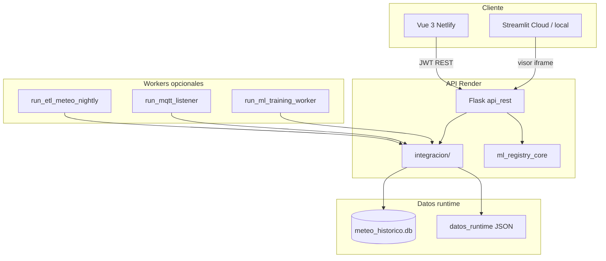

# Prompt de escalamiento — METGO 3D (post-MVP fases 1–10)

Documento maestro para **agentes de IA**, **nuevos desarrolladores** y **planificación de producto** cuando el MVP inicial ya está desplegado y extendido con integración backend 01–12, workers y MLOps.

**Relacionados:** [`PROMPT_MVP_METGO.md`](PROMPT_MVP_METGO.md) (narrativa MVP original) · [`AGENTS.md`](../AGENTS.md) · [`roadmap/README.md`](roadmap/README.md)

---

## 1. Propósito de este documento

| Audiencia | Uso |
|-----------|-----|
| **Cursor / agentes** | Copiar [§12 Prompt listo para pegar](#12-prompt-listo-para-pegar) como contexto de sesión |
| **Tech lead** | Inventario real del repo vs pitch MVP |
| **Producto** | Qué está en producción, qué escalar primero |
| **DevOps** | URLs, workers, cron, métricas, variables `.env` |

El MVP **original** prometía: login único, meteo OpenMeteo, recomendaciones agrícolas, alertas, catálogo y visor Streamlit. El repo **actual** cumple eso y además integra módulos 01–12 vía API, Vue hub `/integracion`, ETL nocturno, IoT/MQTT, registro ML con sanity-check, cola de entrenamiento, notificaciones multicanal y métricas Prometheus.

---

## 2. Estado actual vs MVP inicial

### 2.1 Producción (URLs)

| Componente | URL | Notas |
|------------|-----|--------|
| SPA Vue 3 | https://metgo3d.netlify.app | UI principal |
| API Flask + JWT | https://metgo-api.onrender.com/api | Cold start plan free |
| Streamlit Cloud | https://metgo-3d-quillota-60gb.streamlit.app | `streamlit_app.py` raíz |
| Streamlit Render | https://metgo-streamlit.onrender.com | Visor iframe |
| Local dev | `:5173` + `:8080` | `iniciar_metgo_desarrollo.bat` |

### 2.2 Evolución por fases (integradas en código)

| Fase | Tema | Artefactos clave |
|------|------|------------------|
| **1** | Consolidar MVP | OpenAPI `/api/docs`, CI, health, caché OpenMeteo, `EstadoView` |
| **2** | Producto ampliado | RBAC, alertas CRUD, PWA, Docker dev |
| **3** | Escala MVP | IoT API, ML API, tenants, observabilidad JSON |
| **4** | Integración 01–12 | `api_rest/integracion/*`, `fase4_routes`, histórico alertas, ETL |
| **5** | Conexiones Vue | `IntegracionView`, cableado meteo/agricola/iot/ml |
| **6** | ETL nocturno | `run_etl_meteo_nightly.py`, métricas ETL |
| **7** | MQTT + cola ML | `mqtt_bridge`, `ml_training_queue`, REST ingest |
| **8** | Workers | `run_mqtt_listener.py`, `run_ml_training_worker.py`, `ml_train_runner` |
| **9** | Notificaciones | Webhook + outbox + SMTP opcional, alertas auto |
| **10** | Ops | `/api/metrics`, MQTT TLS, `ml_train_deep` subprocess |

**Health / integración:** `GET /api/health` y `GET /api/integracion/estado` reportan **`fase: "10"`**.

### 2.3 Lo que sigue siendo verdad (límites honestos)

- Puertos **8501–8513** = Streamlit **local**; no existen en Netlify.
- Plan free Render → latencia y cold start.
- Muchos `.joblib`/`.h5` en `06_Modelos_ML_IA` no son **servibles** (sklearn version / dims); solo los que pasan `ml_registry_core.sanity_check`.
- SMTP Zoho plan gratis **no** expone SMTP; usar **webhook** o outbox hasta Mail Lite / ZeptoMail.
- Entrenamiento “profundo” (Fase 10) lanza scripts legacy con timeout; no es un cluster Kubeflow.

---

## 3. Arquitectura del repositorio



### 3.1 Carpetas obligatorias

| Ruta | Rol |
|------|-----|
| `backend/01_Sistema_Meteorologico` | Meteo, umbrales alertas |
| `backend/02_Sistema_Agricola` | Recomendaciones, riego, económico |
| `backend/03_Sistema_IoT_Drones` | Sensores, drones (scripts) |
| `backend/05_APIs_Externas/api_rest` | **API central** |
| `backend/06_Modelos_ML_IA/modelos` | Artefactos ML |
| `backend/08_Gestion_Datos` | Caché, ETL, `datos_runtime/` |
| `frontend/vue` | SPA principal |
| `frontend/dashboards` | Streamlit legacy (puertos locales) |
| `metgo/` | `metgo_paths`, portal, visor |
| `pages/` | Multipágina Streamlit (raíz) |
| `streamlit_app.py` | Entry Streamlit Cloud (**no mover**) |
| `tests/` | Pytest smoke + fase 1–10 |

**Rutas:** siempre `metgo_paths.setup_paths(...)` / `metgo.paths` — nunca hardcodear `04_Dashboards_Unificados`.

---

## 4. API REST — mapa funcional

Base: `/api` · Auth: `POST /api/auth/login` → Bearer JWT · Docs: `/api/docs`

### 4.1 Núcleo MVP

| Área | Endpoints |
|------|-----------|
| Auth | `/auth/login`, `/auth/me` |
| Meteo | `/estaciones`, `/meteo/resumen`, `/meteo/pronostico`, `/meteo/historico` |
| Agrícola | `/agricola/{id}`, `/agricola/{id}/riego`, `/agricola/{id}/avanzado` |
| Alertas | `/alertas`, `/alertas/config` |
| Sistema | `/health`, `/sistema/resumen`, `/modulos` |

### 4.2 Integración y datos (4–6)

| Área | Endpoints |
|------|-----------|
| Integración | `GET /integracion/estado` (público) |
| ETL | `GET /datos/etl/status`, `POST /datos/etl/sync` |
| Store | `GET /datos/meteo/store`, `GET /datos/fuentes` |
| Reportes | `GET /reportes/ultimos`, `GET /reportes/{nombre}` |

### 4.3 IoT, ML, workers (7–10)

| Área | Endpoints |
|------|-----------|
| IoT | `/iot/sensores`, `/iot/lecturas`, `/iot/simular`, `/iot/drones` |
| MQTT | `GET /iot/mqtt/status`, `POST /iot/mqtt/ingestar` |
| ML | `/ml/modelos`, `/ml/resumen`, `/ml/registry`, `/ml/predict/batch` |
| Cola ML | `/ml/train/queue`, `/ml/train/status`, `/ml/train/run`, `/ml/train/deep` |
| Workers | `GET /workers/status` |
| Notificaciones | `/notificaciones/config`, `/notificaciones/status`, `/notificaciones/outbox` |
| Métricas | `GET /metrics` (Prometheus text), `GET /metrics/json` |

OpenAPI: `backend/05_APIs_Externas/api_rest/openapi.yaml` (contract-first en cambios).

---

## 5. Frontend Vue — rutas

| Ruta | Vista | Rol típico |
|------|-------|------------|
| `/` | Panel | Todos |
| `/estado` | Health sistema | Todos |
| `/integracion` | Hub conexiones 01–12 | Autenticado |
| `/meteo`, `/meteo/historico`, `/meteo/comparativo` | Meteo + ETL | Autenticado |
| `/agricola` | Agrícola avanzado | Agrónomo+ |
| `/iot` | Sensores + MQTT | Operador+ |
| `/ml` | Registro ML + cola train | Autenticado |
| `/monitoreo` | Alertas activas | Todos |
| `/alertas/config` | Reglas + notificaciones | Admin/agronomo |
| `/puertos` | Visor Streamlit | Todos |
| `/modulos`, `/servicios`, `/configuracion` | Catálogo / ops | Según RBAC |

API client: `frontend/vue/src/api/metgoApi.js` · Store: `stores/metgo.js` · RBAC: `composables/useRbac.js`

---

## 6. Capa de datos y runtime

| Archivo / carpeta | Contenido |
|-------------------|-----------|
| `datos_runtime/meteo_historico.db` | Histórico ETL OpenMeteo + CSV |
| `datos_runtime/ml_registry.json` | Registro MLOps + sanity |
| `datos_runtime/etl_meteo_metrics.json` | Últimas corridas ETL |
| `datos_runtime/ml_training_queue.json` | Cola train/sync |
| `datos_runtime/mqtt_inbox/` | Mensajes MQTT JSON |
| `datos_runtime/notificaciones_outbox.jsonl` | Email pendiente SMTP |
| `datos_runtime/worker_*.json` | Heartbeats workers |
| `datos_runtime/alertas_historial.json` | Historial alertas |

Caché OpenMeteo: `backend/08_Gestion_Datos/cache_openmeteo.py`

---

## 7. Machine Learning (módulo 06)

| Concepto | Implementación |
|----------|----------------|
| Registro | `ml_registry_core.py` — escaneo paquetes + sanity-check |
| Servible | Carga + dims + predicción prueba OK |
| Paquetes | `modelos_ml_quillota`, `modelos_ml`, `modelos_ml_avanzados`, `modelos_dinamicos`, … |
| Train ligero | `integracion/ml_train_runner.py` → Quillota joblib |
| Train profundo | `integracion/ml_train_deep.py` → subprocess `pipeline_ml_optimizado.py` |
| Sync API | `POST /ml/registry/sync` |

**Escalar ML:** GPU worker separado, versionado MLflow, features desde SQLite real (no sintético), alinear sklearn en CI con producción.

---

## 8. Workers y cron (Windows / Linux)

| Script | Función |
|--------|---------|
| `run_etl_meteo_nightly.py` | ETL diario → SQLite |
| `run_mqtt_listener.py` | MQTT broker o inbox |
| `run_ml_training_worker.py` | Procesa cola ML |
| `run_ml_train_deep.py` | Pipeline profundo |
| `run_notificaciones_outbox_retry.py` | Reintento SMTP outbox |

`.bat` en `backend/10_Deployment_Produccion/scripts/` para Task Scheduler.

---

## 9. Variables de entorno críticas

Ver `.env.example`. Resumen:

| Variable | Uso |
|----------|-----|
| `METGO_JWT_SECRET`, `METGO_PASSWORD_*` | Auth |
| `METGO_CORS_ORIGINS` | Vue local/prod |
| `METGO_ETL_DIAS_SYNC`, `METGO_ETL_SKIP_CSV` | ETL |
| `METGO_MQTT_*`, `METGO_MQTT_TLS` | IoT |
| `METGO_NOTIFY_EMAIL`, `METGO_WEBHOOK_URL` | Alertas |
| `METGO_SMTP_*` | Email real (opcional) |
| `METGO_METRICS_PUBLIC` | Scrape `/api/metrics` |
| `METGO_ML_DEEP_TIMEOUT` | Train profundo |
| `METGO_SENTRY_DSN` | Errores prod |

---

## 10. Vectores de escalamiento (prioridad sugerida)

### 10.1 Corto plazo (1–2 meses)

1. **Render paid / Redis** — eliminar cold start; cache distribuido OpenMeteo.
2. **Webhook producción** — Discord/Slack/Make para alertas sin SMTP.
3. **Prometheus + Grafana** — scrape `https://metgo-api.onrender.com/api/metrics`.
4. **Completar OpenAPI** — todos los endpoints fase 4–10 documentados.
5. **E2E Playwright** — login → meteo → integración smoke.

### 10.2 Medio plazo (3–6 meses)

1. **Multi-tenant real** — aislamiento datos por organización (ya hay JWT tenant).
2. **Migrar 3 dashboards Streamlit críticos a Vue** (fase 2.1 pendiente parcial).
3. **Ingesta IoT real** — broker Mosquitto + TLS en VPS.
4. **MLflow / DVC** — versionado modelos servibles únicamente.
5. **PostgreSQL** — sustituir JSON/SQLite runtime en producción.

### 10.3 Largo plazo

1. App móvil (React Native en repo).
2. APIs MINAGRI / DMC Chile.
3. Gemelo digital / capas 3D (marca METGO 3D).
4. Marketplace módulos vía catálogo API.

---

## 11. Reglas no negociables (heredadas + ampliadas)

1. No mover `streamlit_app.py` sin actualizar Streamlit Cloud y docs.
2. No commitear `.env`, `secrets.toml`, credenciales.
3. No prometer puertos 8501–8513 en Netlify.
4. Siempre `metgo_paths` para rutas de backend.
5. **Vue primero** en pantallas nuevas.
6. **Contract-first:** `openapi.yaml` con cada endpoint nuevo.
7. No `git commit` salvo petición explícita del usuario.
8. Reiniciar API local tras cambios Python en `api_rest/`.

---

## 12. Prompt listo para pegar

```markdown
# Rol

Eres ingeniero senior full-stack en **METGO 3D Quillota**. El producto ya superó el MVP inicial: está en **fase de integración 10** con API Flask, Vue en Netlify, integración módulos backend 01–12, ETL nocturno, IoT/MQTT, MLOps con registro y sanity-check, workers separados y notificaciones multicanal (webhook/outbox/SMTP opcional).

Responde en **español**. Código/commits en inglés técnico si aplica.

# Producción

- Vue: https://metgo3d.netlify.app
- API: https://metgo-api.onrender.com/api
- Streamlit: streamlit_app.py raíz → Streamlit Cloud
- Health: GET /api/health (fase 10)
- Integración: GET /api/integracion/estado
- Métricas: GET /api/metrics

# Arquitectura

- `backend/05_APIs_Externas/api_rest/` — Flask, JWT, fase3–10 routes
- `backend/05_APIs_Externas/api_rest/integracion/` — puentes 01–12
- `backend/08_Gestion_Datos/datos_runtime/` — SQLite + JSON operativos
- `backend/06_Modelos_ML_IA/modelos/` — artefactos; registro en ml_registry_core
- `frontend/vue/` — SPA principal (Vue primero)
- `metgo/`, `pages/`, `streamlit_app.py` — Streamlit (análisis pesado / visor)
- `tests/` — pytest incl. test_fase4 … test_fase10

# Funcionalidad ya implementada (no reimplementar sin motivo)

- OpenAPI, CI, caché OpenMeteo, EstadoView, RBAC, alertas CRUD
- Hub /integracion, ETL sync/status, agrícola avanzado, histórico alertas
- IoT simulado + puente módulo 03, drones, ML registry + batch predict
- MQTT REST/inbox + worker, cola ML train/sync, ml_train_runner Quillota
- Notificaciones webhook + outbox + alertas auto en warning/critical
- Prometheus /api/metrics, MQTT TLS, ml_train_deep subprocess

# Al proponer trabajo

1. Indica encaje: ¿MVP?, ¿fase 11+?, ¿deuda técnica?
2. Archivos exactos a tocar
3. Actualizar openapi.yaml si hay API nueva
4. Comando de verificación (pytest, curl, ruta Vue)
5. Límites nube (puertos locales, cold start, modelos no servibles)

# Referencias obligatorias

- docs/PROMPT_ESCALAMIENTO_MVP.md (este documento)
- docs/PROMPT_MVP_METGO.md
- docs/roadmap/fase-1 … fase-10/
- docs/manuales/QUE_VER_EN_NUBE.md
- AGENTS.md
```

---

## 13. Variante ultra-corta

```text
METGO 3D Quillota — post-MVP fase 10. Vue Netlify + API Render JWT + Streamlit visor. Integración 01–12 en api_rest/integracion/, ETL SQLite, MQTT, MLOps registry, workers cron, webhook/outbox. Usar metgo_paths, Vue primero, openapi.yaml, no puertos 8501-8513 en nube. Escalar: Redis, PG, Grafana /api/metrics, MLflow, E2E. Lee docs/PROMPT_ESCALAMIENTO_MVP.md.
```

---

*Generado al cerrar fase 10. Actualizar tabla §2.2 al integrar fase 11+.*
