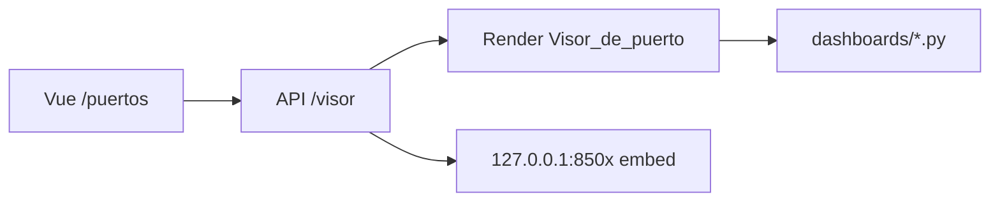

# Visor de Puertos METGO

Sistema unificado para **ver** los dashboards de los puertos 8501–8513 desde la app Vue, sin abrir `127.0.0.1` desde internet.

## Arquitectura

| Capa | Rol |
|------|-----|
| **Vue `/puertos`** | Lista de puertos + iframe |
| **API** `GET /api/servicios/streamlit/{id}/visor` | Devuelve `url_embed` |
| **Streamlit** `pages/4_Visor_de_puerto.py` | Carga el `.py` del módulo en la nube |
| **PC local** | Iframe a `http://127.0.0.1:PUERTO/?embed=true` si el proceso está activo |

## URLs

- Nube: `https://metgo-streamlit.onrender.com/Visor_de_puerto?id=visualizaciones&embed=true`
- Local (proceso activo): `http://127.0.0.1:8506/?embed=true`

## Uso

1. Netlify o local: menú **Visor de puertos**.
2. Elija un puerto en la lista → el iframe carga el dashboard.
3. En PC, si está detenido: **Iniciar y ver**.

## Despliegue

- `METGO_STREAMLIT_CLOUD_URL` en **metgo-api** (Render).
- Servicio **metgo-streamlit** con `streamlit_app.py` (incluye la página Visor).

## Límites

- Un dashboard pesado puede tardar en cold start (plan free Render).
- `streamlit_principal` (8501) abre el portal, no el script legacy completo en visor.
