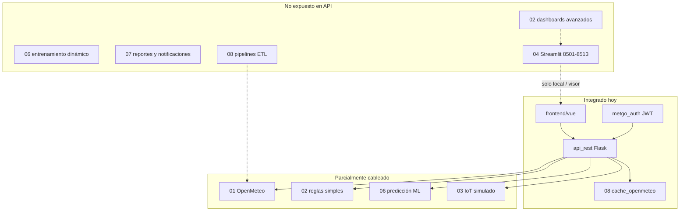

# Auditoría backend módulos 01–12 vs sistema integrado (Vue + API)

**Fecha de revisión:** 2026-05-23  
**Sistema integrado de referencia:** `frontend/vue` + `backend/05_APIs_Externas/api_rest` + `metgo/` + Fases 1–3 del roadmap.

---

## 1. Mapa real del repositorio

Los números **01–12** no están todos bajo `backend/`. En el layout por capas (`metgo.paths`):

| Nº | Carpeta física | Rol |
|----|----------------|-----|
| **01** | `backend/01_Sistema_Meteorologico/` | Meteo, OpenMeteo, notebooks |
| **02** | `backend/02_Sistema_Agricola/` | Riego, heladas, plagas, economía |
| **03** | `backend/03_Sistema_IoT_Drones/` | IoT, drones, satélite |
| **04** | `frontend/dashboards/` + páginas Streamlit | **No está en backend** — UIs legacy |
| **05** | `backend/05_APIs_Externas/` | **API REST** (`api_rest/`) + conectores viejos |
| **06** | `backend/06_Modelos_ML_IA/` | Entrenamiento, modelos joblib/pkl |
| **07** | `backend/07_Sistema_Monitoreo/` | Auth, alertas, reportes, logs |
| **08** | `backend/08_Gestion_Datos/` | ETL, pipelines, `datos/`, runtime |
| **09** | `backend/09_Testing_Validacion/` | Notebooks MIP, tests del módulo |
| **10** | `backend/10_Deployment_Produccion/` | `.bat`, Docker, ngrok, deploy |
| **11** | `docs/manuales/` (y `docs/`) | **Documentación** — no código de negocio |
| **12** | `backend/12_Respaldos_Archivos/` | Obsoletos, backups (~2600 .py archivados) |



---

## 2. Resumen por módulo (exhaustivo)

Leyenda de **integración**:

| Símbolo | Significado |
|---------|-------------|
| ✅ | Usado por API/Vue en producción o dev estándar |
| 🟡 | Subconjunto mínimo integrado; el resto del módulo queda aislado |
| ❌ | No conectado al API; solo scripts/notebooks/dashboards locales |
| ⛔ | Archivo / no integrar (12) |

### 01 — Sistema Meteorológico (`~23 .py`, 5 notebooks)

| Componente | Estado | Notas |
|------------|--------|-------|
| `datos_reales_openmeteo.py` | ✅ | Único puente real vía `api_rest/services.py` (pronóstico/histórico) |
| `cache_openmeteo` (08) | ✅ | TTL 15 min en llamadas API |
| `sistema_alertas_automaticas.py` | ❌ | Lógica duplicada; API usa umbrales simples en `services.generar_alertas` |
| `gestor_datos_meteorologicos.py`, SQLite `datos_meteorologicos.db` | ❌ | No leídos por API |
| `conector_apis_meteorologicas_reales.py`, OpenWeather | ❌ | No expuestos |
| `main.py`, `dashboard_meteorologico_*`, tiempo real | ❌ | Streamlit / CLI local |
| Notebooks MIP (`00_Sistema_Principal_*`) | ❌ | Investigación; sin endpoint |
| Validadores / diagnóstico / limpiador | ❌ | Ops manual |

**Integración estimada:** ~55 % (Fase 4: store SQLite + umbrales 01 en alertas).

**Pendiente prioritario:** unificar alertas con `07` + `01`; opcional lectura SQLite como fuente secundaria; API histórico > 92 días si hay BD local.

---

### 02 — Sistema Agrícola (`~21 .py`)

| Componente | Estado | Notas |
|------------|--------|-------|
| `services.recomendaciones_agricolas()` | 🟡 | ~5 reglas (helada, lluvia, riego); no usa motor avanzado |
| `sistema_recomendaciones_agricolas_avanzado.py` | ❌ | Heladas, plagas, 6 estaciones agrícolas |
| `sistema_riego_inteligente_metgo.py`, `riego_automatizado_metgo.py` | ❌ | |
| `analisis_economico_agricola_metgo*.py` | ❌ | |
| `expansion_regional_*`, Casablanca | ❌ | Relacionado con multi-tenant Fase 3 (parcial) |
| Dashboards agrícolas (varios `dashboard_agricola_*`) | ❌ | Puerto 8503 / Streamlit |
| `ml_avanzado_agricola*.py` | ❌ | Duplica 06 |

**Integración estimada:** ~48 % (Fase 4: `integracion/agricola_avanzado.py` + `/api/agricola/{id}/avanzado`).

**Pendiente prioritario:** riego inteligente y análisis económico como endpoints dedicados.

---

### 03 — Sistema IoT y Drones (`3 .py` + datos drones)

| Componente | Estado | Notas |
|------------|--------|-------|
| `api_rest/iot_services.py` + `/api/iot/*` + `IotView.vue` | 🟡 | Simulación JSON; no MQTT ni drones |
| `sistema_iot_metgo.py` (MQTT, sensores simulados) | ❌ | |
| `conector_iot_satelital.py`, `datos_satelitales_metgo.py` | ❌ | |
| Reportes HTML/JSON en `datos/datos_drones_optimizado/` | ❌ | Solo archivos estáticos |

**Integración estimada:** ~35 % (Fase 4: puente `SensorIoT` módulo 03).

**Pendiente prioritario:** MQTT real; drones; satelital.

---

### 04 — Dashboards unificados (en `frontend/dashboards/`, no en `backend/`)

| Componente | Estado | Notas |
|------------|--------|-------|
| Catálogo `api_rest/catalog.py` | ✅ | Referencia scripts y puertos 8501–8513 |
| Vue (meteo, métricas, comparativo, etc.) | 🟡 | Sustituye parte de 04 según ficha Fase 2 |
| `streamlit_launcher` + Visor | 🟡 | Local o Render; no 13 apps en nube |
| ~15 dashboards Plotly (`dashboard_*.py`) | ❌ | Requieren proceso Streamlit por puerto |

**Integración estimada:** ~40 % funcional vía Vue; ~10 % vía Streamlit embebido.

**Pendiente prioritario:** matriz “dashboard → ruta Vue → deprecar puerto”; migrar ML (8505) y visualizaciones (8506) a Vue.

---

### 05 — APIs externas (`api_rest/` + 9 scripts legacy)

| Componente | Estado | Notas |
|------------|--------|-------|
| `api_rest/` (app, auth, catalog, services, fases 1–3) | ✅ | **Corazón del sistema** |
| OpenAPI `/api/docs` | ✅ | |
| `scripts/conectores_especificos_metgo.py`, `sistema_unificado_con_conectores.py` | ❌ | Pre-REST |
| `sistema_modelos_hibridos_rapido.py` | ❌ | Debería vivir bajo 06 vía API |
| `apis_avanzadas_metgo.py`, configuradores | ❌ | |

**Integración estimada:** ~92 % del módulo 05 (`api_rest` + `integracion/`); scripts legacy ~20 %.

**Pendiente prioritario:** retirar o documentar scripts legacy; un solo entrypoint `iniciar_api_rest.py`.

---

### 06 — Modelos ML e IA (`~27 .py`, muchos modelos en disco)

| Componente | Estado | Notas |
|------------|--------|-------|
| `ml_services.py` + `/api/ml/*` + `MlView.vue` | 🟡 | Lista + predicción con joblib Quillota |
| Artefactos `modelos_ml_quillota/*.joblib` | 🟡 | 5 variables en `configuracion_modelos.json` |
| `modelos_ml/*.joblib` (más variables) | ❌ | No catalogados en API |
| `sistema_modelos_dinamicos.py`, entrenamiento | ❌ | |
| `pipeline_ml_optimizado.py`, deep learning | ❌ | |
| Dashboard ML Streamlit (8505) | ❌ | |

**Integración estimada:** ~45 % (catálogo ampliado + predicción).

**Pendiente prioritario:** registro versiones; cola entrenamiento; deep learning.

---

### 07 — Sistema Monitoreo (`~31 .py`, reportes JSON históricos)

| Componente | Estado | Notas |
|------------|--------|-------|
| `metgo_auth.py` | ✅ | JWT + roles + tenant |
| Alertas API + `alertas_config.json` | 🟡 | No usa `gestion_alertas.py` ni BD |
| `reportes_automaticos_metgo.py`, carpetas `reportes/` | ❌ | Cientos de JSON no servidos |
| `sistema_notificaciones_*`, email/SMS | ❌ | |
| `gestion_usuarios.py`, `auth_module.py` (duplicados auth) | ❌ | Consolidar en `metgo_auth` |
| `monitoreo_tiempo_real.py`, métricas negocio | ❌ | |
| `gestion_logs.py` | 🟡 | API tiene logs JSON (observabilidad Fase 3) |

**Integración estimada:** ~65 % (historial alertas + reportes API).

**Pendiente prioritario:** notificaciones email/SMS; unificar scripts login duplicados.

---

### 08 — Gestión de datos (`~21 .py`, `datos/`, runtime)

| Componente | Estado | Notas |
|------------|--------|-------|
| `cache_openmeteo.py` | ✅ | |
| `datos_runtime/` (alertas, IoT JSON) | ✅ | Escritura API Fase 2–3 |
| `pipeline_completo_metgo.py`, `orquestador_metgo_avanzado.py` | ❌ | |
| `sistema_base_datos_historica_5_anios.py` | ❌ | No alimenta API |
| `integrador_modulos.py`, `sistema_integracion_completo_metgo.py` | ❌ | Visión previa a REST |
| CSV/notebooks en `scripts/` | ❌ | ETL offline |

**Integración estimada:** ~50 % (`meteo_historico.db` + runtime).

**Pendiente prioritario:** pipeline 5 años; Parquet; orquestador.

---

### 09 — Testing y validación (`~22 .py`, 9 notebooks)

| Componente | Estado | Notas |
|------------|--------|-------|
| `tests/` en raíz (smoke API, fase 2–3) | ✅ | 18 tests |
| `09_.../tests/test_sistema_iot.py` etc. | ❌ | No en CI unificada |
| Notebooks auditoría MIP | ❌ | Manual |
| Scripts `verificar_datos_reales.py` | 🟡 | Útil en dev; no automatizado |

**Integración estimada:** ~30 %.

**Pendiente prioritario:** mover tests críticos de 09 a `tests/`; CI con cobertura módulos 01–02–06.

---

### 10 — Deployment producción (`~54 .py`, docker, bat)

| Componente | Estado | Notas |
|------------|--------|-------|
| `iniciar_metgo_desarrollo.bat`, `iniciar_api_rest.py` | ✅ | |
| `render.yaml`, Netlify docs | ✅ | |
| `docker-compose.dev.yml` (Fase 2) | ✅ | |
| `reorganizar_proyecto_v*.py`, muchos `.bat` git | 🟡 | Mantenimiento repo |
| `escalabilidad_metgo.py`, optimizadores | ❌ | No runtime producción |
| `ejecutar_con_ngrok.py` | 🟡 | Opcional demo |

**Integración estimada:** ~50 % (lo necesario para operar); scripts históricos sin uso diario.

**Pendiente prioritario:** un script `deploy_checklist.py`; limpiar bats duplicados; documentar solo 3 comandos oficiales.

---

### 11 — Documentación (`docs/`)

| Componente | Estado | Notas |
|------------|--------|-------|
| Manuales despliegue, MVP, roadmap | ✅ | |
| `generador_documentacion_tecnica.py` | ❌ | Generador masivo desactualizado |

**No requiere integración API** — mantener alineado con rutas Vue/API reales.

---

### 12 — Respaldos y archivos obsoletos

| Componente | Estado | Notas |
|------------|--------|-------|
| `archivos_obsoletos/`, `METGO_3D_OPERATIVO/` | ⛔ | **No integrar** — riesgo de rutas rotas |
| `versionado/migrar_60gb_*` | ⛔ | Solo migración disco |

**Acción:** `.gitignore` / política “no importar desde 12 en código activo” (DT-1).

---

## 3. Qué usa hoy la API (lista cerrada)

Endpoints alimentados principalmente por:

| Fuente | Módulo origen |
|--------|----------------|
| OpenMeteo + caché | 01 + 08 |
| Reglas alertas / agrícola | 05 (inline), no 02 completo |
| Catálogo módulos | 05 + referencias 04 |
| Streamlit launcher | 04 + 10 |
| JWT / roles | 07 |
| ML predict | 06 (subconjunto) |
| IoT JSON | 03 (simulado, Fase 3) |
| Tenants | 05 (nuevo, alinea 02 regional) |

**Todo lo demás** del backend 01–12 requiere trabajo explícito de integración.

---

## 4. Roadmap de integración backend (Fase 4 propuesta)

Prioridad para **incorporar el sistema creado** (Vue + API) sin reescribir todo.

### Fase 4A — Datos y negocio (8–12 semanas)

| ID | Objetivo | Módulos | Entregable | Criterio |
|----|----------|---------|------------|----------|
| **4A.1** | Fuente histórica unificada | 08 → 01 → 05 | Job ETL + `GET /api/meteo/...` desde BD | Histórico 1–5 años sin timeout OpenMeteo |
| **4A.2** | Agrícola completo | 02 → 05 → Vue | `agricola_services.py`, ampliar `/agricola` | Heladas/plagas/riego como en `sistema_recomendaciones_agricolas_avanzado` |
| **4A.3** | Alertas unificadas | 01 + 07 → 05 | Motor único + historial | Una sola lógica; historial en API |
| **4A.4** | IoT real | 03 → 05 | Adaptador MQTT/archivo | ≥1 fuente no simulada |

### Fase 4B — ML y operación (12–16 semanas)

| ID | Objetivo | Módulos | Entregable | Criterio |
|----|----------|---------|------------|----------|
| **4B.1** | MLOps | 06 → 05 | Registro modelos + cola entrenar | Versión por despliegue; sin bloquear API |
| **4B.2** | Reportes | 07 → 05 | `GET /api/reportes/*` o PDF | Reportes automáticos consumibles desde Vue |
| **4B.3** | Notificaciones | 07 → 05 | Webhook / email opcional | Alerta crítica llega fuera de la app |
| **4B.4** | Deprecar Streamlit | 04 | Matriz en catálogo + redirects | 0 puertos obligatorios para operación diaria |

### Fase 4C — Calidad y limpieza (continuo)

| ID | Objetivo | Módulos | Entregable |
|----|----------|---------|------------|
| **4C.1** | DT-1 rutas | 10, 12 | 0 imports desde `12_Respaldos` |
| **4C.2** | Tests módulo | 09 → `tests/` | CI ≥ 40 tests smoke+integración |
| **4C.3** | README por módulo | 01–10 | Sustituir plantillas “[Lista de archivos]” |
| **4C.4** | Auth único | 07 | Eliminar `sistema_autenticacion_metgo.py` duplicados |

---

## 5. Orden recomendado de ejecución

1. **4A.1** (08+01) — desbloquea históricos y ML con datos locales.  
2. **4A.2** (02) — valor agrícola visible en Vue.  
3. **4A.3** (01+07) — coherencia alertas.  
4. **4B.1** (06) — predicciones fiables en producción.  
5. **4A.4** (03) — diferenciación “datos propios”.  
6. **4B.4** (04) — reduce complejidad operativa (puertos).  

---

## 6. Deuda técnica transversal (actualizar DT)

| ID | Estado | Acción |
|----|--------|--------|
| DT-1 Rutas hardcodeadas | Pendiente | Barrer imports desde `12_` y `04_Dashboards_Unificados` |
| DT-2 `.env.example` | Parcial | Completar variables 01–08 (API keys, MQTT, BD) |
| DT-3 `useApiCall` | Parcial | Migrar vistas Vue restantes |

---

## 7. Verificación rápida por módulo (comandos)

```powershell
# 01 — OpenMeteo
python -c "from datos_reales_openmeteo import OpenMeteoData; print(OpenMeteoData().verificar_conexion())"

# 05 — API
python -m pytest tests/ -q

# 06 — modelos en disco
dir backend\06_Modelos_ML_IA\modelos\modelos_ml_quillota

# 08 — runtime
dir backend\08_Gestion_Datos\datos_runtime
```

---

*Documento vivo: actualizar cuando se cierre cada ítem 4A–4C.*
