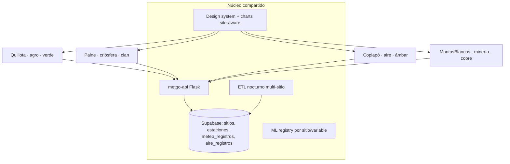
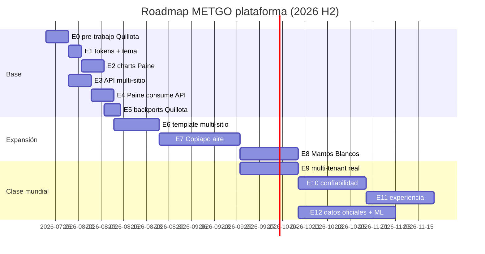

# Plan maestro METGO — plataforma multi-sitio de clase mundial

> **Visión:** METGO deja de ser "el sistema de Quillota" y se convierte en una **plataforma de pronóstico y monitoreo ambiental multi-sitio y multi-dominio**, donde agregar un proyecto nuevo (valle agrícola, parque nacional, ciudad minera, faena) es configuración + datos, no un desarrollo desde cero.
>
> **Documento hermano:** `PLAN_INTEGRACION_QUILLOTA_PAINE.md` (etapas 0–5, base de la plataforma).

---

## 1. Modelo de plataforma: "un sitio = una configuración"

Cada sitio METGO se define por:

| Dimensión | Quillota | Paine | Copiapó | Mantos Blancos |
|-----------|----------|-------|---------|----------------|
| **Dominio** | Agro | Criósfera / outdoor | **Calidad del aire urbana** | **Minería / operaciones** |
| **Identidad** (`--color-primary`) | Verde `#00ffaa` | Cian `#22d3ee` | Ámbar `#fbbf24` (desierto/alerta) | Cobre `#fb923c` |
| **Módulos activos** | Meteo + Agrícola + IoT + ML | Meteo + Lugares | Meteo + **Aire** + Alertas salud | Meteo + Aire + **Operaciones faena** |
| **Fuentes de datos** | OpenMeteo, Agromet* | OpenMeteo | OpenMeteo Air Quality (CAMS), **SINCA** | OpenMeteo AQ, SINCA, sensores faena |
| **Usuarios tipo** | Agricultores, técnicos | Trekkers, guías | Ciudadanía, salud, municipio | Jefes de turno, HSE, planificación |

**Regla de oro:** el dominio cambia los módulos y las variables; el shell, los tokens, los charts, la API y el esquema de datos son los mismos.

---

## 2. Mapa completo de etapas (E0–E12) con tiempos

Estimaciones en **semanas efectivas** (dedicación parcial; una persona + IA). Total: **~5–6 meses** a plataforma completa; hitos demostrables cada 2–3 semanas.

| Etapa | Contenido | Tiempo | Entregable demostrable |
|-------|-----------|--------|------------------------|
| **E0** | Pre-trabajo Quillota (docs stale, gaps §6.3, fichas DT) | 1 sem | Docs consistentes + charts mejorados |
| **E1** | Tokens compartidos + tema ECharts site-aware | 0.5 sem | Mismo tema, 2 identidades |
| **E2** | Charts ECharts en Paine | 1 sem | Paine con gráficos pro |
| **E3** | Modelo `sitios` en Supabase + endpoint + OpenAPI + CORS | 1 sem | API multi-sitio viva |
| **E4** | Paine consume metgo-api (fallback OpenMeteo) | 1 sem | 2 SPAs, 1 backend |
| **E5** | Backports UX a Quillota (toggle, °C/°F, cards) | 1 sem | Quillota mejorada ✅ 2026-07-23 |
| **E6** | **Plantilla `metgo-site-template`** | 2 sem | Sitio nuevo en <1 día ✅ 2026-07-23 |
| **E7** | **Copiapó — calidad del aire** | 3–4 sem | SPA aire + ICAP + salud 🔶 backend 2026-07-23 |
| **E8** | **Mantos Blancos — minería** | 2–3 sem | SPA faena + alertas operacionales |
| **E9** | Multi-tenant real + auth unificada | 2–3 sem | Login/roles por sitio |
| **E10** | Calidad clase mundial I: testing + observabilidad | 3 sem | E2E + SLOs + alertas |
| **E11** | Calidad clase mundial II: PWA, a11y, i18n, performance | 3 sem | Lighthouse >90, offline |
| **E12** | Datos oficiales + ML por dominio | 4+ sem (continuo) | Agromet/DMC/SINCA reales, ML aire |

---

## 3. Detalle de las etapas nuevas

### E6 — Plantilla multi-sitio (`metgo-site-template`)

> **Estado (2026-07-23):** hecho — `templates/metgo-site-template/` + `site.config.js` en Paine; tabla/API `sitios`; sitio demo `demo`.

El paso que permite "seguir incluyendo proyectos" sin costo marginal:

- Repo plantilla: base viva **`metgo-paine`** + checklist en `templates/metgo-site-template/README.md`
- Todo lo específico del sitio en **un archivo**: `src/site.config.js` (ejemplo: `site.config.example.js`)
- Checklist "nuevo sitio en 1 día" en el README del template
- Registrado en código + migración `sitios`: slug, nombre, dominio, paleta, estado (+ seed `demo`)

**Verificación:** `GET /api/public/sitios` · `GET /api/public/estaciones?sitio=demo` · editar solo `site.config.js` en un clone.

### E7 — Copiapó: pronóstico + contaminación atmosférica

> **Estado (2026-07-23):** backend hecho — sitio `copiapo` (3 estaciones), `aire_service.py` (CAMS + ICAP + recomendaciones salud), rutas `/api/public/aire/*`, OpenAPI, migración `aire_registros`, tests. Smoke real OK (PM2.5 3.9 → ICAP 7.8 Bueno). **Pendiente:** SPA desde template, ETL programado, SINCA observado.

**Enfoque:** salud ambiental urbana (polvo desértico, PM10 por vientos, episodios).

**Datos:**
- **Open-Meteo Air Quality API** (modelo CAMS): PM2.5, PM10, SO₂, NO₂, O₃, CO, polvo — global, gratis, misma integración que ya dominamos
- **SINCA** (sinca.mma.gob.cl, MMA Chile): estaciones oficiales de Copiapó/Tierra Amarilla para observación real (scraping/CSV; API no oficial) — pendiente
- Meteo normal OpenMeteo (viento clave para dispersión)

**Backend (fase 2.x–3.x):**
- [x] Tabla `aire_registros` (`supabase/migrations/20260723150000_copiapo_aire.sql`)
- [x] Endpoints: `/api/public/aire/{id}`, `…/pronostico`, `…/historico`, `/api/aire/{id}` (+`openapi.yaml` tag `aire`)
- [x] **ICAP** server-side (tramos DS MMA, contaminante rector PM2.5/PM10, categorías Bueno→Emergencia) — `api_rest/aire_service.py`
- [x] Recomendaciones de salud por categoría en el payload
- [ ] ETL: job aire cada 1–3 h (CAMS) + diario (SINCA)

**Frontend (desde template):**
- Vistas: Panel aire (AQI grande + semáforo), Pronóstico 5 días por contaminante, Mapa de estaciones con color por ICAP, Histórico
- Charts reutilizados: `TimeSeriesChart` (PM2.5/PM10), `HorizontalBarChart` (ranking estaciones), `ComboMeteoChart` (viento vs PM)
- Alertas: umbral ICAP → banner + (futuro) notificación push
- Recomendaciones salud por categoría (análogo a recomendaciones agrícolas)

### E8 — Mantos Blancos (Antofagasta): enfoque minero-operacional

Reusa el 80 % de E7 (aire) + módulo operaciones:

- **Variables críticas de faena:** viento sostenido/ráfagas (tronaduras, polvo en suspensión, izaje), visibilidad, precipitación (caminos), radiación/UV (turnos), SO₂ (fundiciones cercanas)
- **Panel "ventanas operacionales":** semáforo por actividad (tronadura, transporte, izaje) según umbrales configurables de viento/visibilidad
- Alertas por turno (07:00 / 19:00) — reutiliza workers de notificaciones de Quillota
- Puntos seed: rajo, campamento, chancado, ruta de acceso
- Identidad cobre, textos de faena; sin módulo lugares/trekking

### E9 — Multi-tenant real + auth unificada

- JWT `metgo-api` con claim `sitio`/`tenant` obligatorio; RBAC por sitio (admin de Copiapó no ve Mantos Blancos)
- Login de todas las SPAs contra la API (Paine deja el mock localStorage)
- Favoritos/preferencias server-side por usuario+sitio
- Fila de seguridad Supabase (RLS) por `sitio` en tablas de escritura de usuario

### E10 — Clase mundial I: confiabilidad

- **Testing:** E2E Playwright (flujos críticos por sitio), contract tests contra `openapi.yaml`, tests de carga básicos (k6) sobre endpoints cacheados
- **Observabilidad:** Sentry en todas las SPAs + API; `/api/metrics` → dashboard Grafana Cloud (free); alertas de caída ETL/cron
- **SLOs:** definir y medir (API p95 < 800 ms cacheado; frescura datos < 2 h aire, < 24 h meteo)
- **Resiliencia:** healthchecks por sitio, circuit breaker OpenMeteo/SINCA, colas de reintento ETL

### E11 — Clase mundial II: experiencia

- **PWA:** instalable + offline con última data cacheada (crítico en faena/parque sin señal)
- **Accesibilidad:** WCAG AA (contraste ya favorable en dark), navegación teclado, aria en charts
- **i18n:** ES base + EN (Paine tiene turistas; minería tiene contratistas internacionales) — vue-i18n con archivos por sitio
- **Performance:** code-splitting charts, Lighthouse > 90 en 4 sitios, imágenes/iconos optimizados
- **Móvil:** revisión responsive completa (sidebar → drawer)

### E12 — Datos oficiales + ML por dominio (continuo)

- Agromet/DMC códigos reales (Quillota) — pendiente heredado fase 3
- SINCA observado como fuente de verdad para validar CAMS (Copiapó/MB) → métrica de sesgo del modelo
- ML por dominio en el registry existente: helada (Quillota), viento extremo (Paine/MB), episodios PM10 (Copiapó)
- Gobernanza: tabla `fuentes` con licencia/frescura/cobertura por sitio; `tipo_dato` (observado/pronóstico/modelo) en todas las series — patrón ya creado con `TipoDatoBadge`

---

## 4. Todos los puntos faltantes del sistema (consolidado)

Heredados de fases Quillota (detalle en `PLAN_INTEGRACION_QUILLOTA_PAINE.md` E0):

- [ ] §6.3 gaps reales de gráficos (leyenda toggle, click→estación, PNG, skeletons, ML Δ)
- [ ] Docs stale (fase-2/01, PROMPT_REVISION, fichas DT-2/DT-3)
- [ ] DT-1 rutas hardcodeadas
- [ ] SMTP real (Zoho/ZeptoMail) para notificaciones email
- [ ] Redis + webhooks + Prometheus (escalamiento corto plazo)
- [ ] Fase 3.5 Streamlit dedicado (decisión de negocio)
- [ ] Smoke visual Streamlit 8501–8513 (checklist F)
- [ ] Secrets producción: `CRON_SECRET` real en Render + cron-job.org wake

Nuevos de plataforma:

- [ ] Tabla `sitios` + columna `sitio` en `estaciones` (E3)
- [ ] Esquema `aire_registros` + ICAP (E7)
- [ ] Template repo + `site.config.js` (E6)
- [ ] RLS por sitio (E9)
- [ ] E2E multi-sitio + SLOs (E10)
- [ ] PWA + i18n + a11y (E11)

---

## 5. Cronograma sugerido (inicio inmediato)

**Hitos de demo:**
- Semana 3: Paine con gráficos pro + API compartida
- Semana 6: sitio de prueba creado desde template en 1 día
- Semana 10: Copiapó aire con ICAP en producción
- Semana 13: Mantos Blancos operacional
- Mes 5–6: plataforma con SLOs, PWA, i18n → presentable a clientes/fondos

---

## 6. Riesgos y decisiones abiertas

| Riesgo | Mitigación |
|--------|------------|
| SINCA sin API oficial | Partir con CAMS (Open-Meteo AQ); SINCA como validación batch diaria |
| Render free duerme / cuotas | Fallback cliente ya diseñado (E4); evaluar plan pago al sumar Copiapó |
| Cuota OpenMeteo con 4 sitios × ETL | Caché servidor existente + espaciar jobs por sitio |
| Alcance minero requiere umbrales del cliente | `site.config.js` con umbrales editables; defaults conservadores |
| Un solo desarrollador | Etapas cortas con entregable demostrable; nada de big-bang |

## Fase roadmap

E0 → DT/2.x · E1–E5 → 2.x · E6–E8 → 3.x expansión regional (patrón Casablanca del PROMPT_MVP generalizado) · E9 → 3.x multi-tenant real · E10–E12 → escalamiento §10 corto/medio plazo.
