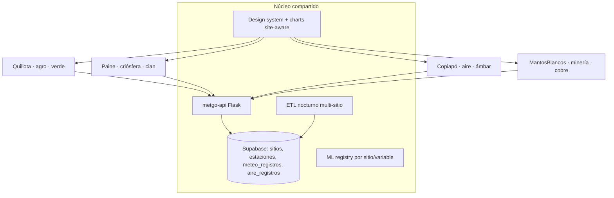

# Plan maestro METGO — plataforma multi-sitio de clase mundial

> **Visión:** METGO deja de ser "el sistema de Quillota" y se convierte en una **plataforma de pronóstico y monitoreo ambiental multi-sitio y multi-dominio**, donde agregar un proyecto nuevo (valle agrícola, parque nacional, ciudad minera, faena) es configuración + datos, no un desarrollo desde cero.
>
> **Documento hermano:** `PLAN_INTEGRACION_QUILLOTA_PAINE.md` (etapas 0–5, base de la plataforma).

---

## 1. Modelo de plataforma: "un sitio = una configuración"

Cada sitio METGO se define por:

| Dimensión | Quillota | Paine | Copiapó | Mantos Blancos |
|-----------|----------|-------|---------|----------------|
| **Dominio** | Agro | Criósfera / outdoor | **Calidad del aire urbana** | **Minería / operaciones** |
| **Identidad** (`--color-primary`) | Verde `#00ffaa` | Cian `#22d3ee` | Ámbar `#fbbf24` (desierto/alerta) | Cobre `#fb923c` |
| **Módulos activos** | Meteo + Agrícola + IoT + ML | Meteo + Lugares | Meteo + **Aire** + Alertas salud | Meteo + Aire + **Operaciones faena** |
| **Fuentes de datos** | OpenMeteo, Agromet* | OpenMeteo | OpenMeteo Air Quality (CAMS), **SINCA** | OpenMeteo AQ, SINCA, sensores faena |
| **Usuarios tipo** | Agricultores, técnicos | Trekkers, guías | Ciudadanía, salud, municipio | Jefes de turno, HSE, planificación |

**Regla de oro:** el dominio cambia los módulos y las variables; el shell, los tokens, los charts, la API y el esquema de datos son los mismos.

---

## 2. Mapa completo de etapas (E0–E12) con tiempos

Estimaciones en **semanas efectivas** (dedicación parcial; una persona + IA). Total: **~5–6 meses** a plataforma completa; hitos demostrables cada 2–3 semanas.

| Etapa | Contenido | Tiempo | Entregable demostrable |
|-------|-----------|--------|------------------------|
| **E0** | Pre-trabajo Quillota (docs stale, gaps §6.3, fichas DT) | 1 sem | Docs consistentes + charts mejorados |
| **E1** | Tokens compartidos + tema ECharts site-aware | 0.5 sem | Mismo tema, 2 identidades |
| **E2** | Charts ECharts en Paine | 1 sem | Paine con gráficos pro |
| **E3** | Modelo `sitios` en Supabase + endpoint + OpenAPI + CORS | 1 sem | API multi-sitio viva |
| **E4** | Paine consume metgo-api (fallback OpenMeteo) | 1 sem | 2 SPAs, 1 backend |
| **E5** | Backports UX a Quillota (toggle, °C/°F, cards) | 1 sem | Quillota mejorada ✅ 2026-07-23 |
| **E6** | **Plantilla `metgo-site-template`** | 2 sem | Sitio nuevo en <1 día ✅ 2026-07-23 |
| **E7** | **Copiapó — calidad del aire** | 3–4 sem | SPA aire + ICAP + salud 🔶 SPA `frontend/copiapo/` 2026-07-23 |
| **E8** | **Mantos Blancos — minería** | 2–3 sem | SPA faena + alertas operacionales ✅ backend+SPA 2026-07-24 |
| **E9** | Multi-tenant real + auth unificada | 2–3 sem | Login/roles por sitio ✅ monorepo 2026-07-24 (Paine repo aparte) |
| **E10** | Calidad clase mundial I: testing + observabilidad | 3 sem | E2E + SLOs + alertas 🔶 MVP 2026-07-24 |
| **E11** | Calidad clase mundial II: PWA, a11y, i18n, performance | 3 sem | Lighthouse >90, offline |
| **E12** | Datos oficiales + ML por dominio | 4+ sem (continuo) | Agromet/DMC/SINCA reales, ML aire |

---

## 3. Detalle de las etapas nuevas

### E6 — Plantilla multi-sitio (`metgo-site-template`)

> **Estado (2026-07-23):** hecho — `templates/metgo-site-template/` + `site.config.js` en Paine; tabla/API `sitios`; sitio demo `demo`.

El paso que permite "seguir incluyendo proyectos" sin costo marginal:

- Repo plantilla: base viva **`metgo-paine`** + checklist en `templates/metgo-site-template/README.md`
- Todo lo específico del sitio en **un archivo**: `src/site.config.js` (ejemplo: `site.config.example.js`)
- Checklist "nuevo sitio en 1 día" en el README del template
- Registrado en código + migración `sitios`: slug, nombre, dominio, paleta, estado (+ seed `demo`)

**Verificación:** `GET /api/public/sitios` · `GET /api/public/estaciones?sitio=demo` · editar solo `site.config.js` en un clone.

### E7 — Copiapó: pronóstico + contaminación atmosférica

> **Estado (2026-07-23):** backend hecho — sitio `copiapo` (3 estaciones), `aire_service.py` (CAMS + ICAP + recomendaciones salud), rutas `/api/public/aire/*`, OpenAPI, migración `aire_registros`, tests. Smoke real OK (PM2.5 3.9 → ICAP 7.8 Bueno). **SPA:** `frontend/copiapo/` (panel ICAP, pronóstico, histórico, tema ámbar). **Pendiente:** deploy Netlify, ETL programado, SINCA observado.

**Enfoque:** salud ambiental urbana (polvo desértico, PM10 por vientos, episodios).

**Datos:**
- **Open-Meteo Air Quality API** (modelo CAMS): PM2.5, PM10, SO₂, NO₂, O₃, CO, polvo — global, gratis, misma integración que ya dominamos
- **SINCA** (sinca.mma.gob.cl, MMA Chile): estaciones oficiales de Copiapó/Tierra Amarilla para observación real (scraping/CSV; API no oficial) — pendiente
- Meteo normal OpenMeteo (viento clave para dispersión)

> **Ampliación (2026-07-24):** módulo **dispersión de contaminantes** — malla airshed de **7 puntos** (≈15 km), `dispersion_service.py` (inversión térmica, capa límite, viento, niebla/estratos costeros, índice de dispersión 0-100), horizontes horaria 72 h / diaria 7 d / **proyección climatológica 16-30 d**, tabla `aire_dispersion`, endpoints `/api/public/aire/*/dispersion*`, vista Vue `DispersionView`. Tests 13/13.
>
> **Ampliación (2026-07-25):** **METGO Airshed Modeler (MAM)** — proxy operativo innovador inspirado en AERMOD/CALMET–CALPUFF–CALPOST (sin binarios EPA). Pipeline 5 pasos, pluma gaussiana + fusión IDW con PM estaciones, frames horarios, vectores de viento. API `GET /api/public/aire/modelo/airshed`, SPA `/airshed` (`AirshedModelView` + MapLibre satélite). No sustituye modelación regulatoria certificada.
>
> **Ampliación (2026-07-25 b):** **Faena Paipote — Observatorio operativo** — ventilación **N/R/M** por hora (72 h), diario 14 d, proyección 30–90 d; corridas **06 UTC** y **18 UTC**; histórico Archive 7 años; soundings modelados; informe HTML/PDF (`/operaciones`, `/sounding`). Cron ETL actualizado.
>
> **Ampliación (2026-07-25 c):** olas de calor otoño/invierno (P90); satélite GOES VIS/IR/WV + diagnóstico incursión nubosa (`/olas-calor`, `/satelite`).
>
> **Ampliación (2026-07-25 d):** panel **Variables en conjunto** (catálogo extensible + Combo multi-serie) — `/conjunto`, API `…/operaciones/{est}/conjunto`.

**Backend (fase 2.x–3.x):**
- [x] Tabla `aire_registros` (`supabase/migrations/20260723150000_copiapo_aire.sql`)
- [x] Endpoints: `/api/public/aire/{id}`, `…/pronostico`, `…/historico`, `/api/aire/{id}` (+`openapi.yaml` tag `aire`)
- [x] **ICAP** server-side (tramos DS MMA, contaminante rector PM2.5/PM10, categorías Bueno→Emergencia) — `api_rest/aire_service.py`
- [x] Recomendaciones de salud por categoría en el payload
- [x] ETL: job aire (CAMS) en `/api/cron/sync` → `aire_registros` + fallback lectura store — `aire_store.py`
- [x] Alertas por umbral ICAP: `/api/public/aire/alertas` + banner SPA
- [x] Dispersión: `aire_dispersion` + `dispersion_service.py` + 4 endpoints + malla 7 puntos
- [x] Migraciones Supabase aplicadas (2026-07-24) + sync local: `aire_registros` 91, `aire_dispersion` 553
- [x] Stub SINCA (`sinca_service.py` + `/api/public/aire/sinca/estado`) — falta código oficial + scraper (E12)
- [ ] SINCA observado (códigos MMA + CSV/scraper diario)

**Frontend (desde template):**
- [x] SPA `frontend/copiapo/` — Panel ICAP, Pronóstico 5 días, Histórico, `site.config.js` ámbar
- [x] Charts ECharts (PM2.5/PM10 + ICAP) + cards por estación
- [x] Recomendaciones salud desde payload API
- [x] Banner de alerta ICAP (`AlertaAireBanner.vue`)
- [x] Vista Dispersión (`DispersionView.vue`): inversión, viento, niebla, índice + 3 horizontes
- [x] Mapa del airshed (`MapaView.vue` + MapLibre dark/Carto + flechas viento + plumas dispersión)
- [x] METGO Airshed Modeler (`/airshed` + `/api/public/aire/modelo/airshed`) — proxy AERMOD/CALPUFF
- [x] Faena Paipote: ventilación N/R/M (72h / 14d / 30–90d), corridas 06/18 UTC, informe PDF, soundings, histórico 7a API
- [x] Deploy Copiapó Cloudflare Pages (`metgo-copiapo.pages.dev`) · Mantos pendiente
- [x] Runbook ops A1–A3: `docs/roadmap/RUNBOOK_OPS_A1_A3.md`

### E8 — Mantos Blancos (Antofagasta): enfoque minero-operacional

> **Estado (2026-07-27):** backend + SPA operaciones ✅ · **observatorio atmósfera** (mapa, dispersión, ventilación N/R/M, sounding, satélite, olas, ICAP, airshed) portado con API faena genérica `/operaciones/faena/mantos_blancos/*`. **Pendiente:** deploy Cloudflare Pages `metgo-mantos` + redeploy Render.

Reusa el 80 % de E7 (aire) + módulo operaciones:

- [x] Variables críticas de faena: viento sostenido/ráfagas, visibilidad, precipitación, **UV**, **SO₂** (CAMS)
- [x] Panel ventanas operacionales: semáforo por actividad según **umbrales configurables**
- [x] Alertas por turno (07:00 / 19:00)
- [x] Puntos seed: rajo, campamento, chancado, ruta de acceso
- [x] Identidad cobre, SPA faena
- [x] Migración + sync Supabase (`operaciones_ventanas` 192 filas, 2026-07-24)
- [x] Catálogo `faena_catalogo` + rutas `/api/public/operaciones/faena/{id}/*` (ventilacion, paquete, olas, satélite)
- [x] SPA Mantos v0.2: mapa MapLibre, dispersión, ventilación N/R/M, sounding, satélite, olas, ICAP, airshed (bbox/fuentes Mantos)
- [ ] Deploy Cloudflare Pages + CORS (`docs/manuales/DESPLIEGUE_VUE_CLOUDFLARE.md`; CORS en `render.yaml` incluye `*.pages.dev` plantilla)
- [ ] Redeploy API Render con código E7/E8

### E9 — Multi-tenant real + auth unificada

> **Estado (2026-07-24):** cerrado en monorepo — JWT `sitio`, filtro estaciones, preferencias,
> login Quillota/Copiapó/Mantos, membresía demo + RLS (escritura solo `service_role`).
> Paine: credencial `paine`/`paine123` lista en API; SPA en repo aparte (aplicar mismo patrón).

- [x] JWT `metgo-api` con claim `sitio`; RBAC por sitio (admin global `sitio=None`)
- [x] Filtrado JWT de listados y estaciones fuera de membresía (meteo/aire/agrícola)
- [x] Favoritos/preferencias server-side por usuario+sitio (`user_preferencias`)
- [x] SPA Quillota: login con `sitio=quillota` + sync prefs
- [x] SPA Copiapó / Mantos Blancos: login JWT + guard de rutas
- [x] Tabla `user_sitio_membresia` + RLS series (SELECT público, write service_role)
- [ ] SPA Paine (repo `metgo-paine`): cablear login contra metgo-api (patrón Copiapó)

### E10 — Clase mundial I: confiabilidad

> **Estado (2026-07-24):** MVP E10 en monorepo — health por sitio, histograma latencia,
> SLOs documentados, contract smoke OpenAPI, Playwright API smoke, k6 smoke, Sentry opcional.
> Pendiente: dashboard Grafana Cloud en cuenta real, E2E UI multi-SPA, CB SINCA.

- [x] `GET /api/health/sitios` — frescura meteo/aire/ops vs SLO
- [x] `docs/roadmap/SLO_E10.md` — p95 &lt; 800 ms, aire &lt; 2 h, meteo &lt; 24 h
- [x] Histograma `metgo_http_request_duration_ms` + gauges frescura en `/api/metrics`
- [x] Sentry opcional API (`METGO_SENTRY_DSN`) + SPAs (`VITE_SENTRY_DSN`)
- [x] Contract smoke OpenAPI + Playwright `e2e/api-smoke.spec.ts` + `loadtests/k6_smoke.js`
- [x] Circuit breaker ligero SINCA (`METGO_SINCA_CB_*`, cooldown en fetch URL) — 2026-07-24
- [x] Cola reintento ETL JSONL (`etl_retry_queue`, drenada en cron) — sin Redis
- [ ] Redis / cola distribuida (escalamiento)
- [ ] E2E UI login por SPA (spec listo: `e2e/ui-login-smoke.spec.ts` + `METGO_UI_BASE`)
- [ ] Grafana Cloud scrape + alertas (checklist en SLO_E10.md)

### E11 — Clase mundial II: experiencia

- [x] **PWA MVP:** Quillota / Copiapó / Mantos con `vite-plugin-pwa`, iconos 192/512, NetworkFirst API
- [x] **Offline banner** + shell instalable (caché SW; i18n diferido)
- [x] **Móvil:** sidebar → drawer + backdrop + skip-link (`:focus-visible`)
- [ ] **a11y charts:** aria en ECharts / deck.gl (resto WCAG)
- [x] **a11y charts (parcial):** TimeSeries, MlProjection, ComboMeteo, HorizontalBar + AireSeries/Mapa + Ventanas
- [x] **i18n MVP Quillota:** vue-i18n ES/EN (login + header + offline); expandir vistas restantes
- [x] **i18n MVP Copiapó/Mantos:** login + header + offline + skip-link (2026-07-24)
- [ ] **i18n:** más claves Quillota/Copiapó/Mantos + Paine
- [ ] **Performance:** Lighthouse > 90 en 4 sitios; code-split charts fino

### E12 — Datos oficiales + ML por dominio (continuo)

- [x] **Gobernanza `fuentes`:** migración Supabase + seed + `GET /api/public/datos/fuentes` (+ bloque en `/api/datos/fuentes`)
- [x] **SINCA E12 MVP:** catálogo + env `METGO_SINCA_IDS` / `METGO_SINCA_CSV_DIR` + `GET /api/public/aire/sinca/sesgo` (CAMS−SINCA)
- [x] **`tipo_dato` aire:** histórico CAMS = `modelo` (no “observado”); filas etiquetadas; badge `Modelo` en Quillota/Copiapó
- [x] **Stubs ML dominio:** `GET /api/public/ml/dominios` (helada, viento extremo, PM10)
- [x] **Agromet/DMC pipeline:** `oficiales_service` + CSV/env + `GET /api/public/datos/oficiales/estado` + cron `oficiales`; DMC Quillota candidato `330007`
- [x] **Baseline PM10 servible:** regla ICAP + fallback
- [x] **Fixtures CSV** SINCA/DMC + tests de ingest
- [x] **Modelo PM10 entrenado:** `GradientBoostingRegressor` ICAP t+1 (CAMS 93 d, MAE≈3.7) en `modelos_dominio_copiapo/`
- [x] **Viento extremo baseline** (Paine/Mantos) servible por umbral
- [x] **SINCA URL template** `METGO_SINCA_CSV_URL` + doc `fase-3/sinca_activacion.md`
- [x] Helada Quillota baseline servible (`clasificar_dano_cultivo` + Tmín)
- [x] Helada Quillota sklearn (`entrenar_helada_quillota.py` + `helada_riesgo.joblib`; fallback baseline)
- [ ] Reentrenar helada/PM10 con histórico oficial (Agromet/DMC/SINCA) cuando haya CSV prod
- [ ] Pegar keys reales SINCA Atacama en Render + CSV diario prod
- [ ] Confirmar Agromet código portal Quillota + DMC en Render env

---

## 4. Todos los puntos faltantes del sistema (consolidado)

Heredados de fases Quillota (detalle en `PLAN_INTEGRACION_QUILLOTA_PAINE.md` E0):

- [x] §6.3 gaps gráficos (leyenda, click→estación, PNG, skeletons, **ML Δ** 2026-07-24)
- [x] Docs fase-2/01 + fichas DT-2/DT-3 (Etapa 0.1) — sync maestro 2026-07-24
- [~] DT-1 rutas hardcodeadas — launchers `ejecutar_sistema_*.py` usan `metgo.paths` (2026-07-24); residual solo scripts migración histórica
- [ ] SMTP real en prod (código Zoho listo; falta `METGO_SMTP_*` en Render)
- [ ] Redis (escalamiento) — webhooks + `/api/metrics` Prometheus-lite ya existen
- [ ] Fase 3.5 Streamlit dedicado (decisión de negocio)
- [ ] Smoke visual Streamlit 8501–8513 (checklist F; launcher local vía `ejecutar_sistema_organizado.py`)
- [ ] Secrets producción: `CRON_SECRET` real en Render + cron-job.org wake

Nuevos de plataforma:

- [x] Tabla `sitios` + columna `sitio` en `estaciones` (E3) — aplicado Supabase 2026-07-24
- [x] Esquema `aire_registros` + ICAP (E7) — + `aire_dispersion` + `operaciones_ventanas` (E8)
- [x] Template repo + `site.config.js` (E6)
- [x] Claim JWT `sitio` + preferencias usuario+sitio + filtro estaciones (E9)
- [x] Login Copiapó/Mantos + `user_sitio_membresia` + RLS write service_role (E9)
- [ ] Login SPA Paine contra metgo-api (E9 resto / repo aparte)
- [x] Health sitios + SLOs + metrics histograma + smoke E2E/k6 (E10 parcial)
- [ ] Grafana Cloud + E2E UI multi-SPA (E10 resto; spec UI listo)
- [x] PWA + drawer móvil + skip-link (E11 MVP)
- [x] i18n ES/EN Quillota + Copiapó/Mantos MVP (E11)
- [ ] i18n claves restantes + a11y charts resto + Lighthouse 90 (E11 resto)
- [x] Tabla `fuentes` + sesgo SINCA + stubs ML dominio (E12 parcial)
- [x] Agromet/DMC CSV+env + baseline PM10 (E12 continuación)
- [x] PM10 sklearn (ICAP t+1) + viento baseline + SINCA URL (E12)
- [x] Helada baseline + sklearn GBT + CB SINCA + cola ETL retry (E12/E10)
- [ ] Keys SINCA/Agromet en prod + reentrenar con observado (E12 resto)
- [x] Quillota en Cloudflare Pages (`metgo-quillota.pages.dev`)

---

- Runbook A1–A3: [`docs/roadmap/RUNBOOK_OPS_A1_A3.md`](RUNBOOK_OPS_A1_A3.md)
- Front Cloudflare: [`docs/manuales/DESPLIEGUE_VUE_CLOUDFLARE.md`](../manuales/DESPLIEGUE_VUE_CLOUDFLARE.md)

## 5. Cronograma sugerido (inicio inmediato)

**Hitos de demo:**
- Semana 3: Paine con gráficos pro + API compartida
- Semana 6: sitio de prueba creado desde template en 1 día
- Semana 10: Copiapó aire con ICAP en producción
- Semana 13: Mantos Blancos operacional
- Mes 5–6: plataforma con SLOs, PWA, i18n → presentable a clientes/fondos

---

## 6. Riesgos y decisiones abiertas

| Riesgo | Mitigación |
|--------|------------|
| SINCA sin API oficial | Partir con CAMS (Open-Meteo AQ); SINCA como validación batch diaria |
| Render free duerme / cuotas | Fallback cliente ya diseñado (E4); evaluar plan pago al sumar Copiapó |
| Cuota OpenMeteo con 4 sitios × ETL | Caché servidor existente + espaciar jobs por sitio |
| Alcance minero requiere umbrales del cliente | `site.config.js` con umbrales editables; defaults conservadores |
| Un solo desarrollador | Etapas cortas con entregable demostrable; nada de big-bang |

## Fase roadmap

E0 → DT/2.x · E1–E5 → 2.x · E6–E8 → 3.x expansión regional (patrón Casablanca del PROMPT_MVP generalizado) · E9 → 3.x multi-tenant real · E10–E12 → escalamiento §10 corto/medio plazo.
