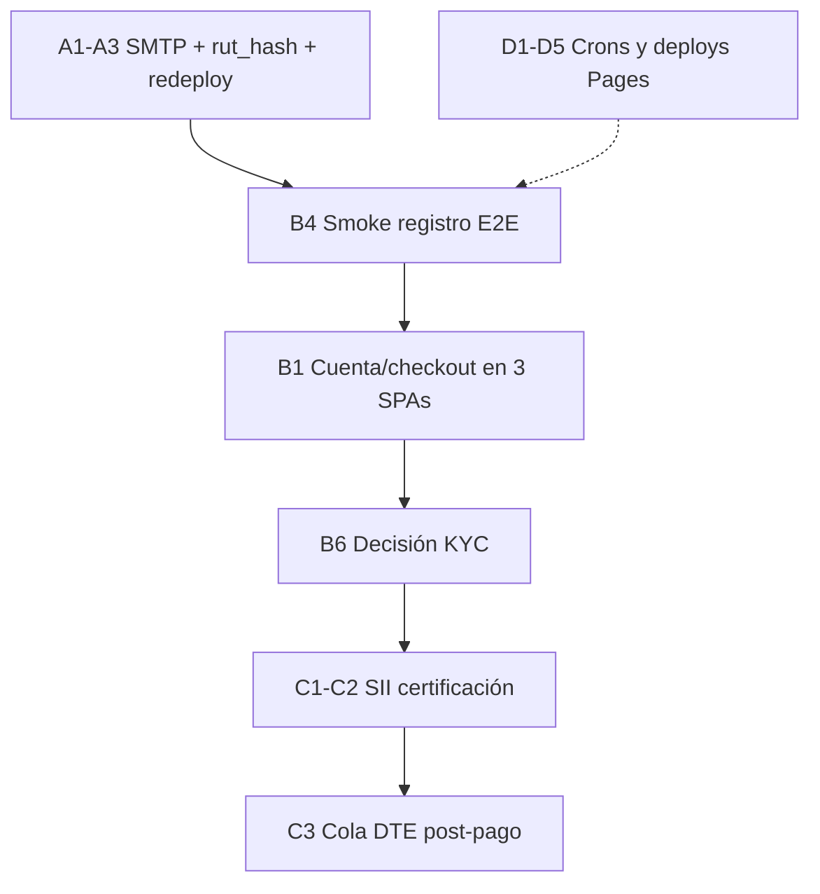

# Plan: condiciones y tareas pendientes (post landings + identity)

> **Corte:** 2026-08-04  
> Consolida lo hecho en landings multi-sitio, registro VENTORA, trial 15 días, RUT único, scaffold SII, y lo que **falta** (ops + código).  
> Relacionado: [`PASOS_PENDIENTES_OPS.md`](PASOS_PENDIENTES_OPS.md) · [`REGISTRO_IDENTITY_Y_SII.md`](REGISTRO_IDENTITY_Y_SII.md) · [`INVENTARIO_CLAVES_PLATAFORMAS.md`](INVENTARIO_CLAVES_PLATAFORMAS.md)

---

## 1. Qué ya está hecho (código)

| Bloque | Condición de “listo” | Estado |
|--------|----------------------|--------|
| Fases API 1–10, E11, E12.1 | Health `fase: 10`, features OK | ✅ |
| Landings públicas | Quillota, Copiapó, Mantos, **Paine**: `/` marketing, `/app` panel | ✅ |
| Live cards alineadas al panel | Helada / ICAP / ventanas vía API pública | ✅ |
| Registro tipo VENTORA | `/registro` + `/verificar` en SPATI, Quillota, Copiapó, Mantos, **Paine** | ✅ |
| Trial 15 días | Catálogo + `current_period_end = now+15d` | ✅ |
| Cobro post-login | Checkout cuando el usuario entra (no al registrarse) | ✅ diseño; Stripe opcional |
| Anti multi-cuenta RUT | `rut_hash` + rechazo `rut_already_registered` | ✅ código; 🔶 migración Supabase |
| Scaffold SII | `scripts/sii/` dry-run boleta/factura | ✅ scaffold (no emisión real) |
| Verify URL por SPA | Env `METGO_*_PUBLIC_URL` | ✅ código |

**Paine:** SPA en repo `metgo-paine` — landing + auth + registro-v2 + push `c78e4eb` (2026-08). Confirmar Pages en prod con Ctrl+F5.

---

## 2. Condiciones de negocio (reglas que deben cumplirse)

| # | Condición | Cómo se cumple hoy | Gap |
|---|-----------|--------------------|-----|
| C1 | Piloto **15 días** gratis al registrarse | Plan `trial`, `$0` | — |
| C2 | Precio Starter/Pro **solo tras entrar** y elegir plan | Checkout JWT en cuenta | UI `/cuenta` en Quillota/Copiapó/Mantos aún no (solo SPATI) |
| C3 | Mismo **RUT** no abre otra org (mismo sitio/faena) aunque cambie email | `rut_hash` | Aplicar migración en Supabase |
| C4 | Email de verificación llega al usuario | `register-v2` + SMTP | **SMTP no configurado** en Render |
| C5 | Al vencer trial sin pago → sin acceso de pago | Gate `/auth/access` | Probar E2E en prod |
| C6 | Identidad fuerte (cédula / ClaveÚnica) antes de facturar | Solo RUT + consentimientos | Decisión B/C/D pendiente |
| C7 | Boleta/factura electrónica Chile | Scaffold scripts | Certificado SII + CAF + certificación |
| C8 | Break-glass ops (`admin`/`mantos`/…) | `METGO_PASSWORD_*` | Confirmar claves en Render (no son demos) |
| C9 | Sin clave demo pública SPATI/VENTORA | Seed off + SQL remove `demo@ventora.demo` | Aplicar migración en Supabase + redeploy API |

---

## 3. Tareas pendientes (priorizadas)

### Bloque A — Ops inmediato (bloquea registro usable)

| ID | Tarea | Condición de aceptación | Dueño |
|----|-------|-------------------------|-------|
| A1 | Configurar **SMTP** en Render (`METGO_SMTP_*`) | `health.s5_ops.smtp_configurado=true`; verify-email llega | ✅ SMTP OK; 🔶 smoke mail |
| A2 | Redeploy API tras SMTP | `s5_ops.pendiente` sin `METGO_SMTP_HOST` | ✅ |
| A3 | Aplicar migración Supabase `20260804150000_orgs_rut_hash_unique.sql` | Columna `orgs.rut_hash` + índice unique | ✅ |
| A4 | Confirmar / documentar `METGO_PASSWORD_MANTOS`, `_COPIAPO`, `_ADMIN` | Login break-glass OK en cada SPA | Ops |
| A5 | (Opcional) Stripe keys + Price IDs | Checkout real; si no, mock OK | Ops / comercial |
| A6 | Env verify URLs en Render (`METGO_MANTOS_PUBLIC_URL`, etc.) | Link del mail apunta al SPA correcto | Ops |
| A7 | Aplicar `20260804160000_remove_demo_ventora.sql` + confirmar `METGO_SEED_DEMO_PREVIEW` ≠ 1 | Login `demo@ventora.demo` → 401 | ✅ |

### Bloque B — Producto identity (código + UX)

| ID | Tarea | Condición de aceptación | Dueño |
|----|-------|-------------------------|-------|
| B1 | Vista **Cuenta / planes / checkout** en Quillota, Copiapó, Mantos (como SPATI) | Usuario trial puede pagar Starter/Pro tras login | ✅ código |
| B2 | Banner “quedan X días de piloto” en panel | Visible si `trialing` | ✅ código |
| B3 | Flujo **invitar usuario** a org existente (mismo RUT) | Segundo correo entra sin re-registrar RUT | ✅ API + UI `/cuenta` |
| B4 | Smoke E2E: registro → verify → login → trial → checkout mock | Checklist pasado en Pages + Render | Dev + Ops |
| B5 | Port registro/landing a **Paine** (repo `metgo-paine`) | `/` landing, `/app` JWT, `/registro` `sitio=paine` | ✅ push `c78e4eb`; verificar Pages |
| B6 | Decidir KYC: ClaveÚnica vs proveedor vs revisión manual | ADR escrito en roadmap | ✅ [`ADR_KYC_IDENTIDAD.md`](ADR_KYC_IDENTIDAD.md) (piloto = manual) |
| B7 | Implementar nivel B o C de identidad (según B6) | Representante verificado antes de plan pago / DTE | Dev |

### Bloque C — Facturación SII

| ID | Tarea | Condición de aceptación | Dueño |
|----|-------|-------------------------|-------|
| C1 | Obtener certificado `.p12` + CAF + ambiente cert SII | Vars `SII_*` en secret manager (no git) | Contabilidad / ops |
| C2 | Completar firma/envío en `scripts/sii` (o LibreDTE/OpenFactura) | Dry-run firmado en cert; track ID SII | Dev |
| C3 | Cola post-webhook Stripe → emitir boleta 39 / factura 33 | DTE asociado a `org_id` + email PDF | Dev |
| C4 | Certificación SII → producción | Emisión real legal | Contabilidad |

### Bloque D — Datos y alertas (ya en PASOS P1–P2)

| ID | Tarea | Condición de aceptación | Dueño |
|----|-------|-------------------------|-------|
| D1 | `CRON_SECRET` igual en Render y GitHub Actions | Cron SPATI/ETL corre | ✅ |
| D2 | Destinos alerta en UI umbrales SPATI | Email/webhook guardados | 🔶 ops UI; M9 usa destinos por faena |
| D3 | CSV/IDs SINCA / Agromet / DMC prod | `e12_ops` sin pendientes de IDs | Ops |
| D4 | `METGO_OPENMETEO_API_KEY` | Menos 429 | Ops |
| D5 | Deploy Cloudflare de landings+registro (Quillota/Copiapó/Mantos) | `/registro` vivo en `*.pages.dev` | Ops |

### Bloque E — Deuda menor / calidad

| ID | Tarea | Notas |
|----|-------|-------|
| E1 | Cold start Render (free) | Documentado; wake con reintentos en SPAs |
| E2 | Landing Mantos “Solicitar acceso” → `/registro` en todos los CTAs | Revisar CTAs residuales a `/login` |
| E3 | Commit/push de cambios locales (landings, identity, SII) | Solo cuando el usuario lo pida |
| E4 | WordPress / marketing: enlaces a Pages (no Netlify legado) | Fuera de monorepo |

---

## 4. Orden recomendado (2–3 sesiones)

1. **Sesión ops (1–2 h):** A1–A6 + D5 (deploy Pages).  
2. **Sesión producto:** B1–B4.  
3. **Sesión comercial/legal:** B6 + C1; luego C2–C4.

---

## 5. Criterio de “plataforma lista para clientes”

- [ ] Registro + verify-email funciona en los 4 SPAs (SMTP OK).  
- [ ] Trial 15 días visible y enforceable.  
- [ ] RUT no se puede reutilizar (migración aplicada).  
- [ ] Checkout post-login (mock o Stripe) en cada producto.  
- [ ] Break-glass documentado; clientes solo por identity.  
- [ ] (Antes de cobrar en serio) KYC o ClaveÚnica según B6.  
- [ ] (Antes de boletas legales) SII certificado.

---

## Fase

**Ops P0–P2** + **Producto 2.x identity** + **DT-billing/SII** · sin nueva fase MVP de monitoreo.
