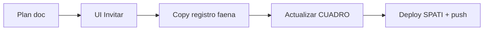

# Plan de trabajo — mejoras METGO (corte 2026-08-05)

> Ejecución: código en esta sesión · ops humano marcado **Ops**.  
> Relacionado: [`PASOS_PENDIENTES_OPS.md`](PASOS_PENDIENTES_OPS.md) · [`PLAN_PENDIENTES_POST_LANDINGS_IDENTITY.md`](PLAN_PENDIENTES_POST_LANDINGS_IDENTITY.md)

---

## Objetivo

Dejar la plataforma **usable por clientes** (registro → mail → panel → alertas → plan) y reducir deuda de UX/identity, sin bloquear en Stripe/SII todavía.

---

## Fase A — Cerrar “listo para cliente” (esta semana)

| # | Mejora | Tipo | Criterio de hecho | Dueño |
|---|--------|------|-------------------|-------|
| A1 | Smoke registro → verify → login → `/app` | Ops | Mail Zoho llega; link abre SPA correcto | **Humano** |
| A2 | Guardar destinos en `/f/{faena}/umbrales` | Ops | Emails en Supabase `alertas_destino` | **Humano** |
| A3 | UI **Invitar usuario** en `/cuenta` | Código | Formulario llama `POST /api/auth/invitar` | ✅ hecho |
| A4 | Copy registro SPATI: faena fijada por URL | Código | `/f/escondida/registro` explica “cuenta para Escondida” | ✅ hecho |
| A5 | Confirmar `METGO_*_PUBLIC_URL` en Render | Ops | Link del mail = Pages correcto | Humano |

## Fase B — Producto identity / cobro (1–2 semanas)

| # | Mejora | Tipo | Notas |
|---|--------|------|-------|
| B1 | Stripe keys + Price IDs | Ops | Hoy checkout mock OK |
| B2 | ADR KYC (ClaveÚnica / proveedor / manual) | Producto | Antes de DTE |
| B3 | Banner + gate trial vencido E2E | Código+Ops | Ya hay banner; probar con cuenta trial |

## Fase C — Datos oficiales / calidad (continuo)

| # | Mejora | Tipo |
|---|--------|------|
| C1 | `METGO_OPENMETEO_API_KEY` | Ops |
| C2 | IDs SINCA / Agromet / DMC + CSV prod | Ops |
| C3 | Retrain helada/PM10 con histórico largo | Dev+Ops |

## Fase D — Facturación Chile (después de cobro)

| # | Mejora |
|---|--------|
| D1 | Certificado SII `.p12` + CAF |
| D2 | Firma/envío DTE en `scripts/sii` |
| D3 | Cola Stripe webhook → boleta/factura |

## Fase E — Deuda UX menor

| # | Mejora |
|---|--------|
| E1 | CTAs “Solicitar acceso” → `/registro` residuales |
| E2 | Cold start: mensaje wake ya existe; monitorear Render free |
| E3 | WordPress → enlaces `*.pages.dev` (no Netlify legado) |

---

## Orden de ejecución (esta sesión)

**No ejecutar ahora (bloquean secretos humanos):** A1, A2, A5, B1, C1–C2, D*.

---

## Fase documento

**Producto 2.x / Ops P1** · plan vivo; actualizar al cerrar cada fila.
