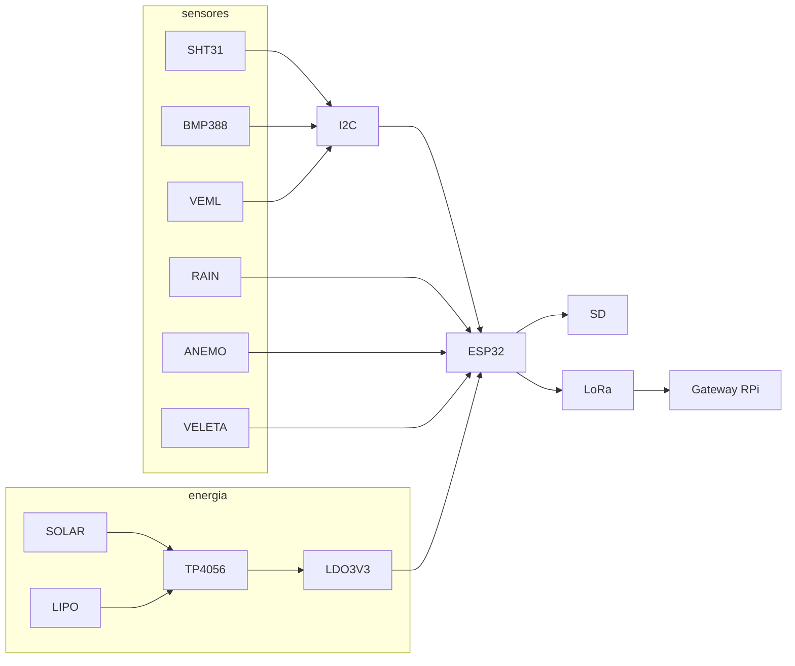

# Pinout PCB — Nodo ESP32 METGO DIY v1

Esquema lógico (no sustituye Gerber KiCad). Alimentación 3.3 V regulada desde TP4056/boost.

## Mapa de pines

| Función | GPIO | Notas |
|---------|------|-------|
| I2C SDA | 21 | SHT31, BMP388, VEML6075, DS3231, AS3935 |
| I2C SCL | 22 | Pull-ups 4.7k |
| LoRa SCK | 18 | VSPI |
| LoRa MISO | 19 | |
| LoRa MOSI | 23 | |
| LoRa NSS | 5 | |
| LoRa RST | 14 | |
| LoRa DIO0 | 26 | TX done / RX |
| SD CS | 15 | SPI compartido; CS exclusivo |
| Rain tip | 33 | RTC GPIO → EXT0 wake (activo LOW) |
| Anemómetro | 32 | reed, pull-up |
| Veleta ADC | 34 | **solo ADC1** (válido en deep sleep) |
| OneWire DS18B20 | 4 | opcional |
| PMS RX/TX | 16/17 | UART2 opcional |
| US TRIG/ECHO | 25/27 | viento ultrasónico opcional |

## Netlist resumida

```text
3V3 ── SHT31.VDD, BMP388.VDD, VEML.VDD, DS3231.VCC, LoRa.VCC, SD.VCC
GND ── todos GND
SDA/SCL ── bus I2C común
SPI ── LoRa + SD (CS separados: GPIO5 / GPIO15)
GPIO33 ── reed tipping bucket ── GND (debounce RC 100n + 10k)
GPIO32 ── reed anemómetro ── GND
GPIO34 ── wiper veleta (divisor 0–3.3V)
VBAT ── LiPo ── TP4056 ── 3V3 LDO (AP2112 o similar)
SOLAR+ ── panel 6V ── TP4056 IN (diodo Schottky)
```

## Diagrama bloques



## Reglas PCB

1. Mantener antena LoRa lejos de planos GND grandes y del panel solar.
2. Condensadores 100 nF en cada sensor I2C cerca de VDD.
3. Pistas anemómetro/lluvia con pull-up y filtro RC (rebote).
4. Separar tierra analógica (veleta) de retornos de motor/reed si hay ruido.
5. Conector JST para batería con polaridad marcada; fusible PTC en VBAT.

Próximo: exportar a KiCad (`pcb/kicad/` cuando se dibuje el layout).
