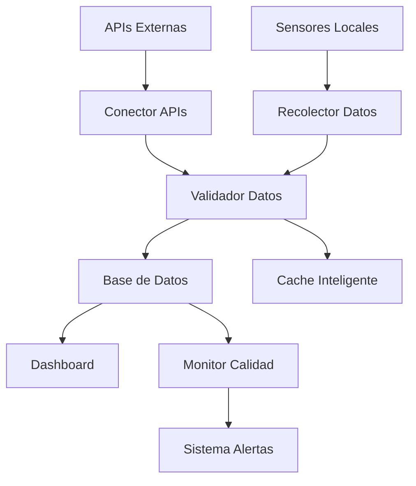

# 📊 Procesos de Gestión de Datos Meteorológicos METGO 3D

## 📋 Índice
1. [Introducción](#introducción)
2. [Arquitectura del Sistema](#arquitectura-del-sistema)
3. [Flujo de Datos](#flujo-de-datos)
4. [Procesos de Validación](#procesos-de-validación)
5. [Monitoreo y Alertas](#monitoreo-y-alertas)
6. [Mantenimiento](#mantenimiento)
7. [Troubleshooting](#troubleshooting)
8. [Mejores Prácticas](#mejores-prácticas)

## 🎯 Introducción

Este documento describe los procesos de gestión de datos meteorológicos en el sistema METGO 3D. El sistema está diseñado para recopilar, validar, almacenar y monitorear datos meteorológicos de múltiples fuentes con alta confiabilidad y calidad.

### Objetivos
- **Confiabilidad**: 99.9% de disponibilidad de datos
- **Calidad**: >90% de datos válidos
- **Tiempo Real**: Actualización cada 15 minutos
- **Trazabilidad**: Auditoría completa de cambios

## 🏗️ Arquitectura del Sistema



### Componentes Principales

#### 1. **Conector de APIs** (`conector_apis_meteorologicas_reales.py`)
- **Propósito**: Integración con APIs meteorológicas externas
- **APIs Soportadas**: OpenMeteo, OpenWeatherMap, AccuWeather
- **Frecuencia**: Cada 15 minutos
- **Fallback**: Datos simulados si fallan APIs

#### 2. **Validador de Datos** (`validador_datos_avanzado.py`)
- **Propósito**: Validación y limpieza de datos
- **Validaciones**: Rangos, consistencia, formatos, outliers
- **Puntuación**: Sistema de calidad 0-100

#### 3. **Monitor de Calidad** (`monitor_calidad_datos.py`)
- **Propósito**: Monitoreo continuo de calidad
- **Métricas**: Disponibilidad, latencia, errores
- **Alertas**: Automáticas por umbrales

#### 4. **Gestor de Datos** (`gestor_datos_meteorologicos.py`)
- **Propósito**: Gestión centralizada de datos
- **Funciones**: Cache, backup, sincronización

## 🔄 Flujo de Datos

### 1. Recolección de Datos

```python
# Proceso de recolección
def recolectar_datos():
    datos_raw = []
    
    # 1. Intentar APIs externas
    for api in apis_configuradas:
        try:
            datos_api = conectar_api(api)
            datos_raw.extend(datos_api)
        except Exception as e:
            logger.error(f"Error en API {api}: {e}")
    
    # 2. Fallback a datos simulados
    if not datos_raw:
        datos_raw = generar_datos_simulados()
    
    return datos_raw
```

### 2. Validación de Datos

```python
# Proceso de validación
def validar_datos(datos_raw):
    validador = ValidadorDatosAvanzado()
    datos_validados = []
    
    for registro in datos_raw:
        resultado = validador.validar_registro_completo(registro)
        
        if resultado.es_valido:
            datos_validados.append(resultado.datos_limpiados)
        else:
            logger.warning(f"Registro inválido: {resultado.errores}")
    
    return datos_validados
```

### 3. Almacenamiento

```python
# Proceso de almacenamiento
def almacenar_datos(datos_validados):
    conn = sqlite3.connect('datos_meteorologicos.db')
    
    for registro in datos_validados:
        # Insertar con validación adicional
        insertar_registro(conn, registro)
    
    conn.commit()
    conn.close()
```

## 🛡️ Procesos de Validación

### Tipos de Validación

#### 1. **Validación de Rangos**
```python
RANGOS_VALIDOS = {
    'temperatura_maxima': (-50, 50),
    'precipitacion_diaria': (0, 500),
    'humedad_relativa': (0, 100),
    'viento_velocidad': (0, 200)
}
```

#### 2. **Validación de Consistencia**
- Temperatura máxima ≥ temperatura mínima
- Precipitación ≥ 0
- Humedad entre 0-100%

#### 3. **Validación de Formatos**
- Timestamp en formato ISO
- Direcciones de viento en formato cardinal
- Valores numéricos válidos

#### 4. **Detección de Outliers**
```python
def detectar_outliers(valores):
    Q1 = np.percentile(valores, 25)
    Q3 = np.percentile(valores, 75)
    IQR = Q3 - Q1
    
    limite_inferior = Q1 - 1.5 * IQR
    limite_superior = Q3 + 1.5 * IQR
    
    return (valores < limite_inferior) | (valores > limite_superior)
```

### Puntuación de Calidad

| Criterio | Puntuación | Descripción |
|----------|------------|-------------|
| Sin errores | 100 | Datos perfectos |
| Campos requeridos | -10/campo | Por campo faltante |
| Errores de validación | -15/error | Por error encontrado |
| Advertencias | -5/advertencia | Por advertencia |

## 📊 Monitoreo y Alertas

### Métricas Monitoreadas

#### 1. **Calidad de Datos**
- Porcentaje de registros válidos
- Número de errores por hora
- Campos faltantes

#### 2. **Disponibilidad**
- Estado de APIs externas
- Latencia de respuestas
- Tiempo de inactividad

#### 3. **Rendimiento**
- Tiempo de procesamiento
- Uso de memoria
- Tamaño de base de datos

### Sistema de Alertas

#### Niveles de Alerta

| Nivel | Color | Condición | Acción |
|-------|-------|-----------|--------|
| **Crítica** | 🔴 | Calidad < 80% | Notificación inmediata |
| **Advertencia** | 🟠 | Calidad < 90% | Monitoreo aumentado |
| **Info** | 🔵 | Cambios normales | Log únicamente |

#### Configuración de Umbrales

```json
{
    "umbrales_alertas": {
        "calidad_minima": 80.0,
        "disponibilidad_minima": 95.0,
        "latencia_maxima": 30.0,
        "errores_maximos_por_hora": 10
    }
}
```

## 🔧 Mantenimiento

### Tareas Diarias

#### 1. **Verificación de APIs**
```bash
python scripts/diagnostico_datos_meteorologicos.py
```

#### 2. **Validación de Datos**
```bash
python scripts/validador_datos_avanzado.py
```

#### 3. **Revisión de Alertas**
- Verificar logs de alertas
- Resolver alertas críticas
- Actualizar configuración si es necesario

### Tareas Semanales

#### 1. **Auditoría de Datos**
```bash
python scripts/auditor_datos_meteorologicos.py
```

#### 2. **Limpieza de Datos**
- Eliminar registros duplicados
- Limpiar datos corruptos
- Optimizar base de datos

#### 3. **Backup de Datos**
```bash
python scripts/backup_datos_meteorologicos.py
```

### Tareas Mensuales

#### 1. **Análisis de Tendencias**
- Revisar métricas de calidad
- Identificar patrones de errores
- Optimizar procesos

#### 2. **Actualización de Configuración**
- Revisar umbrales de alertas
- Actualizar rangos de validación
- Mejorar mapeo de campos

## 🚨 Troubleshooting

### Problemas Comunes

#### 1. **Datos No Actualizados**

**Síntomas:**
- Dashboard muestra datos antiguos
- Alertas de datos faltantes

**Diagnóstico:**
```bash
# Verificar estado de APIs
python scripts/diagnostico_datos_meteorologicos.py

# Revisar logs
tail -f logs/gestor_datos_meteorologicos.log
```

**Solución:**
1. Verificar conectividad a internet
2. Revisar configuración de APIs
3. Reiniciar servicios si es necesario

#### 2. **Calidad de Datos Baja**

**Síntomas:**
- Alertas de calidad crítica
- Muchos errores de validación

**Diagnóstico:**
```bash
# Ejecutar auditoría completa
python scripts/auditor_datos_meteorologicos.py

# Revisar validaciones
python scripts/validador_datos_avanzado.py
```

**Solución:**
1. Revisar fuentes de datos
2. Ajustar umbrales de validación
3. Implementar limpieza de datos

#### 3. **Alertas Frecuentes**

**Síntomas:**
- Múltiples alertas por hora
- Alertas falsas positivas

**Diagnóstico:**
```bash
# Revisar configuración de alertas
cat scripts/config_monitor_calidad.json

# Analizar patrones de alertas
python scripts/analizar_alertas.py
```

**Solución:**
1. Ajustar umbrales de alertas
2. Mejorar lógica de detección
3. Implementar filtros de alertas

### Comandos de Diagnóstico

#### Verificar Estado del Sistema
```bash
# Estado general
python scripts/diagnostico_datos_meteorologicos.py

# Validación de datos
python scripts/validador_datos_avanzado.py

# Monitor de calidad
python scripts/monitor_calidad_datos.py

# Auditoría completa
python scripts/auditor_datos_meteorologicos.py
```

#### Logs Importantes
```bash
# Logs principales
tail -f logs/gestor_datos_meteorologicos.log
tail -f logs/monitor_calidad_datos.log

# Logs de errores
grep "ERROR" logs/*.log
grep "CRITICAL" logs/*.log
```

## 💡 Mejores Prácticas

### 1. **Gestión de Datos**

#### ✅ Hacer
- Validar datos en tiempo real
- Mantener múltiples fuentes de datos
- Implementar cache inteligente
- Documentar todos los cambios

#### ❌ Evitar
- Confiar en una sola fuente
- Ignorar alertas de calidad
- Almacenar datos sin validar
- No tener respaldos

### 2. **Monitoreo**

#### ✅ Hacer
- Monitorear métricas clave
- Configurar alertas apropiadas
- Revisar reportes regularmente
- Actuar sobre alertas críticas

#### ❌ Evitar
- Sobrecargar con alertas
- Ignorar tendencias
- No documentar incidentes
- Falta de plan de respuesta

### 3. **Mantenimiento**

#### ✅ Hacer
- Mantenimiento preventivo
- Actualizaciones regulares
- Limpieza de datos
- Optimización continua

#### ❌ Evitar
- Mantenimiento reactivo únicamente
- Ignorar warnings
- Acumular datos innecesarios
- No probar cambios

### 4. **Documentación**

#### ✅ Hacer
- Documentar todos los procesos
- Mantener documentación actualizada
- Incluir ejemplos prácticos
- Documentar decisiones importantes

#### ❌ Evitar
- Documentación desactualizada
- Falta de ejemplos
- No documentar errores
- Documentación incompleta

## 📞 Contacto y Soporte

### Equipo de Desarrollo
- **Líder del Proyecto**: METGO 3D Team
- **Versión**: 2.0
- **Última Actualización**: 2025-01-09

### Recursos Adicionales
- **Documentación API**: `docs/api_docs/`
- **Manuales de Usuario**: `docs/manuales/`
- **Reportes de Calidad**: `reportes/`
- **Logs del Sistema**: `logs/`

### Escalación de Problemas
1. **Nivel 1**: Verificar documentación y troubleshooting
2. **Nivel 2**: Contactar equipo de desarrollo
3. **Nivel 3**: Escalación a arquitectura del sistema

---

*Documento de Procesos de Gestión de Datos Meteorológicos METGO 3D*  
*Versión 1.0 - Enero 2025*

